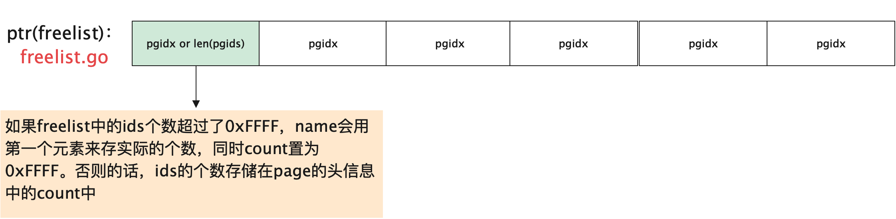
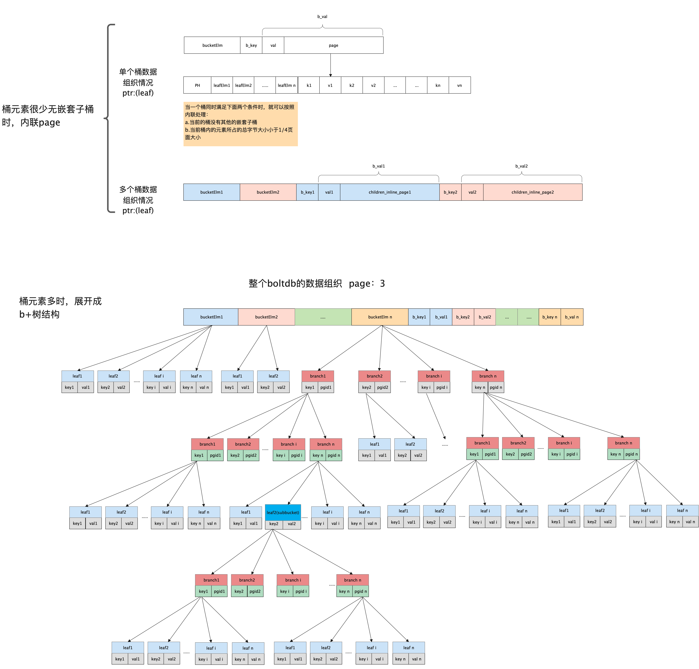

# boltdb源码剖析

## 1.boltdb简要介绍                              

本章使我们的开篇，我们主要从以下几个方面做一个讲述。希望从这章开始，让大家认识一下boltdb。为后续的内容做一个铺垫。

1. boltdb是什么？
2. 为什么要分析boltdb？
3. boltdb的简单用法
4. boltdb的整体数据组织结构
5. boltdb的黑科技


### 1.1 boltdb是什么？

在用自己的话介绍boltdb之前，我们先看下boltdb官方是如何自我介绍的呢？

> Bolt is a pure Go key/value store inspired by [Howard Chu's][hyc_symas]
  [LMDB project][lmdb]. The goal of the project is to provide a simple,
  fast, and reliable database for projects that don't require a full database
  server such as Postgres or MySQL.
  
>  Since Bolt is meant to be used as such a low-level piece of functionality,
  simplicity is key. The API will be small and only focus on getting values
  and setting values. That's it.

看完了官方的介绍，接下来让我用一句话对boltdb进行介绍：

**boltdb是一个纯go编写的支持事务的文件型单机kv数据库。**

下面对上述几个核心的关键词进行一一补充。

**纯go：** 意味着该项目只由golang语言开发，不涉及其他语言的调用。因为大部分的数据库基本上都是由c或者c++开发的，boltdb是一款难得的golang编写的数据库。

**支持事务：** boltdb数据库支持两类事务：**读写事务**、**只读事务**。这一点就和其他kv数据库有很大区别。

**文件型：** boltdb所有的数据都是存储在磁盘上的，所以它属于文件型数据库。其他个人理解，在某种维度来看，boltdb很像一个简陋版的innodb存储引擎。都涉及数据在内存和磁盘的转换。但不同的是，innodb在事务上的支持比较强大。

**单机：** boltdb不是分布式数据库，它是一款单机版的数据库。个人认为比较适合的场景是，用来做wal日志或者读多写少的存储场景。

**kv数据库：** boltdb不是sql类型的关系型数据库，它和redis类型，对外暴露的是kv的接口，不过boltdb支持的数据类型key和value都是[]byte。

### 1.2 为什么要分析boltdb？

前文介绍完了什么是boltdb。那我们先扪心自问一下，为什么要学习、分析boltdb呢？闲的吗？

答案：当然不是。我们先看看其他几个人对这个问题是如何答复的。

github用户ZhengHe-MD是这么答复的：

> 要达到好的学习效果，就要有输出。以我平时的工作节奏，在闲暇时间依葫芦画瓢写一个键值数据库不太现实。于是我选择将自己对源码阅读心得系统地记录下来，
> 最终整理成本系列文章，旨在尽我所能正确地描述 boltDB。恰好我在多次尝试在网上寻找相关内容后，发现网上大多数的文章、视频仅仅是介绍 boltDB 
> 的用法和特性。因此，也许本系列文章可以作为它们以及 boltDB 官方文档 的补充，帮助想了解它的人更快地、深入地了解 boltDB。
> 如果你和我一样是初学者，相信它对你会有所帮助；如果你是一名经验丰富的数据库工程师，也许本系列文章对你来说没有太多新意。


微信公众号作者TheFutureIsOurs是这么答复的：
[boltdb源码阅读](https://mp.weixin.qq.com/s/QfcHJ7dazjRUSC3vCMuofQ)

> 最近抽时间看了boltdb的源码，代码量不大（大概4000行左右），而且支持事务，结构也很清晰，由于比较稳定，已经归档，确实是学习数据库的最佳选择。
> 而且不少出名的开源项目在使用它，比如etcd，InfluxDB等。
  本文记录下笔者在阅读源码后了解到的其工作原理，以留备忘。

下面我来以自身的角度来回答下这个问题：

首先其实在互联网里面，所有的系统、软件都离不开数据。而提到数据，无非我们就会想到数据的存储和数据检索。这些功能不就是一个数据库最基本的吗。从而数据库在计算机的世界里面
有着无比重要的位置。作为一个有梦想的程序员，总是想知其然并知其所以然。这个是驱动我决定看源码的原因之一。

其次最近在组里高涨系统学习mysql、redis的氛围下，我也加入了阵营。想着把这两块知识好好消化、整理一番。尤其是mysql，大家主要还是以核心学习innodb存储引擎为目标。本人
也不例外，在我看完了**从跟上理解mysql**后。整体上对innodb有了宏观和微观的了解和认识，但是更近一步去看mysql的代码。有几个难点：1.本人项目主要以golang为主。说实话看
c和c++的项目或多或少有些难度；2.mysql作为上古神兽，虽然功能很完善，但是要想短期内看完源码基本上是不可能的，而工作之余的时间有限，因此性价比极低。而boltdb完美的符合了
我的这两个要求。所以这就是选择boltdb的第二个原因，也是一个主要原因。


主要还是想通过分析这个项目，在下面三个方面有所提升。

1. 一方面让自己能加深原先学习的理论知识  
2. 另外一方面也能真正的了解工程如何做的，有一个清晰的认识；  
3. 最后也是希望借助这个项目开启个人存储方向的大门。  


介绍完了学习bolt是什么？为什么要分析boltdb后，我们就正式进入主题了。让我们先以一个简单例子认识下boltdb。 

### 1.3 boltdb的简单用法

其实boltdb的用法很简单，从其项目github的文档里面就可以看得出来。它本身的定位是key/value(后面简称为kv)存储的嵌入式数据库，因此那提到kv我们自然而然能想到的最常用的操作，就是set(k,v)和get(k)了。确实如此boltdb也就是这么简单。

不过在详细介绍boltdb使用之前，我们先以日常生活中的一些场景来作为切入点，引入一些在boltdb中抽象取来的专属名词(DB、Bucket、Cursor、k/v等)，下面将进入正文，前面提到boltdb的使用确实很简单，就是set和get。但它还在此基础上还做了一些额外封装。下面通过现实生活对比来介绍这些概念。

boltdb本质就是存放数据的，那这和现实生活中的柜子就有点类似了，如果我们把boltdb看做是一个存放东西的柜子的话，它里面可以存放各种各样的东西，确实是的，但是我们想一想，所有东西都放在一起会不会有什么问题呢？

咦，如果我们把钢笔、铅笔、外套、毛衣、短袖、餐具这些都放在一个柜子里的话，会有啥问题呢？这对于哪些特别喜欢收拾屋子，东西归类放置的人而言，简直就是一个不可容忍的事情，因为所有的东西都存放在一起，当东西多了以后就会显得杂乱无章。

在生活中我们都有分类、归类的习惯，例如对功能类似的东西(钢笔、铅笔、圆珠笔等)放一起，或者同类型的东西(短袖、长袖等)放一起。把前面的柜子通过隔板来隔开，分为几个小的小柜子，第一柜子可以防止衣服，第二个柜子可以防止书籍和笔等。当然了，这是很久以前的做法了，现在买的柜子，厂家都已经将其内部通过不同的存放东西的规格做好了分隔。大家也就不用为这些琐事操心了。既然这样，那把**分类、归类**这个概念往计算机中迁移过来，尤其是对于存放数据的数据库，当然此处也就是boltdb了，它也需要有分类、归类的思想，因为归根到底，它也是由人创造出来的嘛。

好了到这儿，我们引入我们的三大名词了**“DB”**、**“Bucket”**、**“k/v”**。

**DB：** 对应我们上面的柜子。

**Bucket：** 对应我们将柜子分隔后的小柜子或者抽屉了。

**k/v：** 对应我们放在抽泣里的每一件东西。为了方便我们后面使用的时候方便，我们需要给每个东西都打上一个标记，这个标记是可以区分每件东西的，例如k可以是该物品的颜色、或者价格、或者购买日期等，v就对应具体的东西啦。这样当我们后面想用的时候，就很容易找到。尤其是女同胞们的衣服和包包，哈哈

再此我们就可以得到一个大概的层次结构，一个柜子(DB)里面可以有多个小柜子(Bucket)，每个小柜子里面存放的就是每个东西(k/v)啦。

那我们想一下，我们周末买了一件新衣服，回到家，我们要把衣服放在柜子里，那这时候需要怎么操作呢？

很简单啦，下面看看我们平常怎么做的。

**第一步：**如果家里没有柜子，那就得先买一个柜子；

**第二步：**在柜子里找找之前有没有放置衣服的小柜子，没有的话，那就分一块出来，总不能把新衣服和钢笔放在一块吧。

**第三步：**有了放衣服的柜子，那就里面找找，如果之前都没衣服，直接把衣服打上标签，然后丢进去就ok啦；如果之前有衣服，那我们就需要考虑要怎么放了，随便放还是按照一定的规则来放。这里我猜大部分人还是会和我一样吧。喜欢按照一定的规则放，比如按照衣服的新旧来摆放，或者按照衣服的颜色来摆放，或者按照季节来摆放，或者按照价格来摆放。哈哈

我们在多想一下，周一早上起来我们要找一件衣服穿着去上班，那这时候我们又该怎么操作呢？

**第一步：**去找家里存放东西的柜子，家里没柜子，那就连衣服都没了，尴尬...。所以我们肯定是有柜子的，对不对

**第二步：**找到柜子了，然后再去找放置衣服的小柜子，因为衣服在小柜子存放着。

**第三步：**找到衣服的柜子了，那就从里面找一件衣服了，找哪件呢！最新买的？最喜欢的？天气下雨了，穿厚一点的？天气升温了，穿薄一点的？今天没准可能要约会，穿最有气质的？.....

那这时候根据**不同场景来确定了规则**，明确了我们要找的衣服的标签，找起来就会很快了。我们一下子就能定位到要穿的衣服了。嗯哼，这就是**排序、索引**的威力了

如果之前放置的衣服没有按照这些规则来摆放。那这时候就很悲剧了，就得挨个挨个找，然后自己选了。哈哈，有点**全表扫描**的味道了


啰里啰嗦扯了一大堆，就是为了给大家科普清楚，一些boltdb中比较重要的概念，让大家对比理解。降低理解难度。下面开始介绍boltdb是如何简单使用的。

使用无外乎两个操作：**set**、**get**

```go

import "bolt"

func main(){
	// 我们的大柜子
	db, err := bolt.Open("./my.db", 0600, nil)
	if err != nil {
		panic(err)
	}
	defer db.Close()
	// 往db里面插入数据
	err = db.Update(func(tx *bolt.Tx) error {
	   //我们的小柜子
		bucket, err := tx.CreateBucketIfNotExists([]byte("user"))
		if err != nil {
			log.Fatalf("CreateBucketIfNotExists err:%s", err.Error())
			return err
		}
		//放入东西
		if err = bucket.Put([]byte("hello"), []byte("world")); err != nil {
			log.Fatalf("bucket Put err:%s", err.Error())
			return err
		}
		return nil
	})
	if err != nil {
		log.Fatalf("db.Update err:%s", err.Error())
	}
	
	// 从db里面读取数据
	err = db.View(func(tx *bolt.Tx) error {
		//找到柜子
		bucket := tx.Bucket([]byte("user"))
		//找东西
		val := bucket.Get([]byte("hello"))
		log.Printf("the get val:%s", val)
		val = bucket.Get([]byte("hello2"))
		log.Printf("the get val2:%s", val)
		return nil
	})
	if err != nil {
		log.Fatalf("db.View err:%s", err.Error())
	}
}
```


### 1.4 boltdb的整体数据组织结构

下面这幅图完整的表现了boltdb中数据在磁盘file上、每页page的格式、内存node中的组织情况。先从整体上给大家展示一下，大家暂时看不懂不要紧，后面章节会详细的分析每一部分的内容。


### 1.5 boltdb的黑科技

下面从整体上给大家介绍一下，boltdb中比较有特色的几个feature。

**1. mmap**

在boltdb中所有的数据都是以page页为单位组织的，那这时候通常我们的理解是，当通过索引定位到具体存储数据在某一页时，然后就现在现在页缓存中找，如果页没有缓存，则打开数据库文件中开始读取那一页的数据就好了。
但这样的话性能会极低。boltdb中是通过mmap内存映射技术来解决这个问题。当数据库初始化时，就会进行内存映射，将文件中的数据映射到内存中的一段连续空间，后续再读取某一页的数据时，直接在内存中读取。性能大幅度提升。
  
**2. b+树**  

在boltdb中，索引和数据时按照b+树来组织的。其中一个bucket对象对应一颗b+树，叶子节点存储具体的数据，非叶子节点只存储具体的索引信息，很类似mysql innodb中的主键索引结构。同时值得注意的是所有的bucket也构成了一颗树。但该树不是b+树。


**3. 嵌套bucket**  

前面说到，在boltdb中，一个bucket对象是一颗b+树，它上面存储一批kv键值对。但同时它还有一个特性，一个bucket下面还可以有嵌套的subbucket。subbucket中还可以有subbucket。这个特性也很重要。


## 2.boltdb的核心数据结构分析

从一开始，boltdb的定位就是一款文件数据库，顾名思义它的数据都是存储在磁盘文件上的，目前我们大部分场景使用的磁盘还是机械磁盘。而我们又知道数据落磁盘其实是一个比较慢的操作(此处的快慢是和操作内存想对比而言)。所以怎么样在这种**硬件条件无法改变的情况下，如何提升性能**就成了一个恒定不变的话题。而提升性能就不得不提到它的数据组织方式了。所以这部分我们主要来分析boltdb的核心数据结构。

我们都知道，操作磁盘之所以慢，是因为对磁盘的读写耗时主要包括：**寻道时间**+**旋转时间**+**传输时间**。而这儿的大头主要是在**寻道时间**上，因为寻道是需要移动磁头到对应的磁道上，移动磁臂是一种机械运动，比较耗时。我们往往对磁盘的操作都是随机读写，简而言之，随机读写的话，需要频繁移动磁头到对应的磁道。这种方式性能比较低。还有一种和它对应的方式：**顺序读写**。顺序读写的性能要比随机读写高很多。

因此，所谓的提升性能，无非就是尽可能的减少磁盘的随机读写，更大程度采用顺序读写的方式。这是**主要矛盾**，不管是mysql还是boltdb他们都是围绕这个核心来展开的。**如何将用户写进来在内存中的数据采用顺序写的方式放进磁盘，同时在用户读时，将磁盘中保存的数据按照顺序读的方式加载到内存中，近而返回用户**。这里面就涉及到具体的数据在磁盘、内存中的组织结构以及相互转换了。下面我们就对这一块进行详细的分析。

这里面主要包含几块内容：一个是它在磁盘上的数据组织结构page、一个是它在内存中的数据组织结构node、还有一个是page和node之间的相互转换关系。

这里先给大家科普一点：

**set操作：** 本质上对应的是 node->page->file的过程

**get操作：** 本质上对应的是 file->page->node的过程

### 2.1 boltdb的物理页page结构

在boltdb中，一个db对应一个真实的磁盘文件。而在具体的文件中，boltdb又是按照以page为单位来读取和写入数据的，也就是说所有的数据在磁盘上都是按照页(page)来存储的，而此处的页大小是保持和操作系统对应的内存页大小一致，也就是4k。


每页由两部分数据组成：**页头数据**+**真实数据**，页头信息占16个字节，下面的页的结构定义

```go
type pgid uint64

type page struct {
	// 页id 8字节
	id pgid
	// flags：页类型，可以是分支，叶子节点，元信息，空闲列表  2字节，该值的取值详细参见下面描述
	flags uint16
	// 个数 2字节，统计叶子节点、非叶子节点、空闲列表页的个数
	count uint16
	// 4字节，数据是否有溢出，主要在空闲列表上有用
	overflow uint32
	// 真实的数据
	ptr uintptr
}

```

其中，ptr是一个无类型指针，它就是表示每页中真实的存储的数据地址。而其余的几个字段(id、flags、count、overflow)为我们前面提到的页头信息。

下图展现的是boltdb中page的数据存储方式。


在boltdb中，它把页划分为四类：

page页类型 | 类型定义 | 类型值 | 用途
---|--- | --- | ---
分支节点页 |branchPageFlag | 0x01 | 存储索引信息(页号、元素key值)
叶子节点页  |	leafPageFlag     | 0x02 | 存储数据信息(页号、插入的key值、插入的value值)
元数据页    |	metaPageFlag     | 0x04 | 存储数据库的元信息，例如空闲列表页id、放置桶的根页等
空闲列表页  |freelistPageFlag | 0x10 | 存储哪些页是空闲页，可以用来后续分配空间时，优先考虑分配

boltdb通过定义的常量来描述

```go
// 页头的大小：16字节
const pageHeaderSize = int(unsafe.Offsetof(((*page)(nil)).ptr))

const minKeysPerPage = 2

//分支节点页中每个元素所占的大小
const branchPageElementSize = int(unsafe.Sizeof(branchPageElement{}))
//叶子节点页中每个元素所占的大小
const leafPageElementSize = int(unsafe.Sizeof(leafPageElement{}))

const (
	branchPageFlag   = 0x01 //分支节点页类型
	leafPageFlag     = 0x02 //叶子节点页类型
	metaPageFlag     = 0x04 //元数据页类型
	freelistPageFlag = 0x10 //空闲列表页类型
)
```

同时每页都有一个方法来判断该页的类型，我们可以清楚的看到每页时通过其flags字段来标识页的类型。

```go
// typ returns a human readable page type string used for debugging.
func (p *page) typ() string {
	if (p.flags & branchPageFlag) != 0 {
		return "branch"
	} else if (p.flags & leafPageFlag) != 0 {
		return "leaf"
	} else if (p.flags & metaPageFlag) != 0 {
		return "meta"
	} else if (p.flags & freelistPageFlag) != 0 {
		return "freelist"
	}
	return fmt.Sprintf("unknown<%02x>", p.flags)
}

```

下面我们一一对其数据结构进行分析。

### 2.2 元数据页

每页有一个meta()方法，如果该页是元数据页的话，可以通过该方法来获取具体的元数据信息。

```go
// meta returns a pointer to the metadata section of the page.
func (p *page) meta() *meta {
	// 将p.ptr转为meta信息
	return (*meta)(unsafe.Pointer(&p.ptr))
}

```

详细的元数据信息定义如下：

```go
type meta struct {
	magic    uint32 //魔数
	version  uint32 //版本
	pageSize uint32 //page页的大小，该值和操作系统默认的页大小保持一致
	flags    uint32 //保留值，目前貌似还没用到
	root     bucket //所有小柜子bucket的根
	freelist pgid //空闲列表页的id
	pgid     pgid //元数据页的id
	txid     txid //最大的事务id
	checksum uint64 //用作校验的校验和
}
```

下图展现的是元信息存储方式。


下面我们重点关注该meta数据是如何写入到一页中的，以及如何从磁盘中读取meta信息并封装到meta中

**1. meta->page**

```go

db.go

// write writes the meta onto a page.
func (m *meta) write(p *page) {
	if m.root.root >= m.pgid {
		panic(fmt.Sprintf("root bucket pgid (%d) above high water mark (%d)", m.root.root, m.pgid))
	} else if m.freelist >= m.pgid {
		panic(fmt.Sprintf("freelist pgid (%d) above high water mark (%d)", m.freelist, m.pgid))
	}

	// Page id is either going to be 0 or 1 which we can determine by the transaction ID.
	//指定页id和页类型
	p.id = pgid(m.txid % 2)
	p.flags |= metaPageFlag

	// Calculate the checksum.
	m.checksum = m.sum64()
  // 这儿p.meta()返回的是p.ptr的地址，因此通过copy之后，meta信息就放到page中了
	m.copy(p.meta())
}


// copy copies one meta object to another.
func (m *meta) copy(dest *meta) {
	*dest = *m
}


// generates the checksum for the meta.
func (m *meta) sum64() uint64 {
	var h = fnv.New64a()
	_, _ = h.Write((*[unsafe.Offsetof(meta{}.checksum)]byte)(unsafe.Pointer(m))[:])
	return h.Sum64()
}
```

**2. page->meta**

```go
page.go

// meta returns a pointer to the metadata section of the page.
func (p *page) meta() *meta {
	// 将p.ptr转为meta信息
	return (*meta)(unsafe.Pointer(&p.ptr))
}

```


### 2.3 空闲列表页

空闲列表页中主要包含三个部分：所有已经可以重新利用的空闲页列表ids、将来很快被释放掉的事务关联的页列表pending、页id的缓存。详细定义在**freelist.go**文件中，下面给大家展示其空闲页的定义。

```go
freelist.go

// freelist represents a list of all pages that are available for allocation.
// It also tracks pages that have been freed but are still in use by open transactions.
type freelist struct {
	// 已经可以被分配的空闲页
	ids     []pgid          // all free and available free page ids.
	// 将来很快能被释放的空闲页，部分事务可能在读或者写
	pending map[txid][]pgid // mapping of soon-to-be free page ids by tx.
	cache   map[pgid]bool   // fast lookup of all free and pending page ids.
}

// newFreelist returns an empty, initialized freelist.
func newFreelist() *freelist {
	return &freelist{
		pending: make(map[txid][]pgid),
		cache:   make(map[pgid]bool),
	}
}
```

下图展示的是空闲列表的存储方式。



**1. freelist->page**

将空闲列表转换成页信息，写到磁盘中，此处需要注意一个问题，页头中的count字段是一个uint16，占两个字节，其最大可以表示2^16 即65536个数字，当空闲页的个数超过65535时时，需要将p.ptr中的第一个字节用来存储其空闲页的个数，同时将p.count设置为0xFFFF。否则不超过的情况下，直接用count来表示其空闲页的个数

```go
// write writes the page ids onto a freelist page. All free and pending ids are
// saved to disk since in the event of a program crash, all pending ids will
// become free.
//将 freelist信息写入到p中
func (f *freelist) write(p *page) error {
	// Combine the old free pgids and pgids waiting on an open transaction.

	// Update the header flag.
	// 设置页头中的页类型标识
	p.flags |= freelistPageFlag

	// The page.count can only hold up to 64k elements so if we overflow that
	// number then we handle it by putting the size in the first element.

	lenids := f.count()
	if lenids == 0 {
		p.count = uint16(lenids)
	} else if lenids < 0xFFFF {
		p.count = uint16(lenids)
		// 拷贝到page的ptr中
		f.copyall(((*[maxAllocSize]pgid)(unsafe.Pointer(&p.ptr)))[:])
	} else {
		// 有溢出的情况下，后面第一个元素放置其长度，然后再存放所有的pgid列表
		p.count = 0xFFFF
		((*[maxAllocSize]pgid)(unsafe.Pointer(&p.ptr)))[0] = pgid(lenids)
		// 从第一个元素位置拷贝
		f.copyall(((*[maxAllocSize]pgid)(unsafe.Pointer(&p.ptr)))[1:])
	}
	return nil
}
```

**2. page->freelist**

从磁盘中加载空闲页信息，并转为freelist结构，转换时，也需要注意其空闲页的个数的判断逻辑，当p.count为0xFFFF时，需要读取p.ptr中的第一个字节来计算其空闲页的个数。否则则直接读取p.ptr中存放的数据为空闲页ids列表

```go
//从磁盘中的page初始化freelist
// read initializes the freelist from a freelist page.
func (f *freelist) read(p *page) {
	// If the page.count is at the max uint16 value (64k) then it's considered
	// an overflow and the size of the freelist is stored as the first element.
	idx, count := 0, int(p.count)
	if count == 0xFFFF {
		idx = 1
		// 用第一个uint64来存储整个count的值
		count = int(((*[maxAllocSize]pgid)(unsafe.Pointer(&p.ptr)))[0])
	}

	// Copy the list of page ids from the freelist.
	if count == 0 {
		f.ids = nil
	} else {
		ids := ((*[maxAllocSize]pgid)(unsafe.Pointer(&p.ptr)))[idx:count]
		f.ids = make([]pgid, len(ids))
		copy(f.ids, ids)

		// Make sure they're sorted.
		sort.Sort(pgids(f.ids))
	}

	// Rebuild the page cache.
	f.reindex()
}
```

**3. allocate**

开始分配一段连续的n个页。其中返回值为初始的页id。如果无法分配，则返回0即可

```go
// allocate returns the starting page id of a contiguous list of pages of a given size.
// If a contiguous block cannot be found then 0 is returned.
// [5,6,7,13,14,15,16,18,19,20,31,32]
// 开始分配一段连续的n个页。其中返回值为初始的页id。如果无法分配，则返回0即可
func (f *freelist) allocate(n int) pgid {
	if len(f.ids) == 0 {
		return 0
	}

	var initial, previd pgid
	for i, id := range f.ids {
		if id <= 1 {
			panic(fmt.Sprintf("invalid page allocation: %d", id))
		}

		// Reset initial page if this is not contiguous.
		// id-previd != 1 来判断是否连续
		if previd == 0 || id-previd != 1 {
			// 第一次不连续时记录一下第一个位置
			initial = id
		}

		// If we found a contiguous block then remove it and return it.
		// 找到了连续的块，然后将其返回即可
		if (id-initial)+1 == pgid(n) {
			// If we're allocating off the beginning then take the fast path
			// and just adjust the existing slice. This will use extra memory
			// temporarily but the append() in free() will realloc the slice
			// as is necessary.
			if (i + 1) == n {
				// 找到的是前n个连续的空间
				f.ids = f.ids[i+1:]
			} else {
				copy(f.ids[i-n+1:], f.ids[i+1:])
				f.ids = f.ids[:len(f.ids)-n]
			}

			// Remove from the free cache.
			// 同时更新缓存
			for i := pgid(0); i < pgid(n); i++ {
				delete(f.cache, initial+i)
			}

			return initial
		}

		previd = id
	}
	return 0
}
```


### 2.4 分支节点页

分支节点主要用来构建索引，方便提升查询效率。下面我们来看看boltdb的分支节点的数据是如何存储的。

**1. 分支节点页中元素定义：**

分支节点在存储时，一个分支节点页上会存储多个分支页元素即branchPageElement。这个信息可以记做为分支页元素元信息。元信息中定义了具体该元素的页id(pgid)、该元素所指向的页中存储的最小key的值大小、最小key的值存储的位置距离当前的元信息的偏移量pos。下面是branchPageElement的详细定义：

```go
// branchPageElement represents a node on a branch page.
type branchPageElement struct {
	pos   uint32 //该元信息和真实key之间的偏移量
	ksize uint32
	pgid  pgid
}

// key returns a byte slice of the node key.
func (n *branchPageElement) key() []byte {
	buf := (*[maxAllocSize]byte)(unsafe.Pointer(n))
	// pos~ksize
	return (*[maxAllocSize]byte)(unsafe.Pointer(&buf[n.pos]))[:n.ksize]
}
```

**2. 分支节点页page中获取下标为index的某一个element的信息和获取全部的elements信息**

```go
// branchPageElement retrieves the branch node by index
func (p *page) branchPageElement(index uint16) *branchPageElement {
	return &((*[0x7FFFFFF]branchPageElement)(unsafe.Pointer(&p.ptr)))[index]
}

// branchPageElements retrieves a list of branch nodes.
func (p *page) branchPageElements() []branchPageElement {
	if p.count == 0 {
		return nil
	}
	return ((*[0x7FFFFFF]branchPageElement)(unsafe.Pointer(&p.ptr)))[:]
}
```

下图展现的是非叶子节点存储方式。


**在内存中，分支节点页和叶子节点页都是通过node来表示，只不过的区别是通过其node中的isLeaf这个字段来区分。下面和大家分析分支节点页page和内存中的node的转换关系。**

下面在介绍具体的转换关系前，我们介绍一下内存中的分支节点和叶子节点是如何描述的。

```go
// node represents an in-memory, deserialized page.
type node struct {
	bucket     *Bucket
	isLeaf     bool
	unbalanced bool
	spilled    bool
	key        []byte
	pgid       pgid
	parent     *node
	children   nodes
	inodes     inodes
}
```

在内存中，具体的一个分支节点或者叶子节点都被抽象为一个node对象，其中是分支节点还是叶子节点主要通通过其isLeaf字段来区分。下面对分支节点和叶子节点做两点说明：

1. 对叶子节点而言，其没有children这个信息。同时也没有key信息。isLeaf字段为true，其上存储的key、value都保存在inodes中

2. 对于分支节点而言，其具有key信息，同时children也不一定为空。isLeaf字段为false，同时该节点上的数据保存在inode中。

为了方便大家理解，node和page的转换，下面大概介绍下inode和nodes结构。我们在下一章会详细介绍node。

```go

const (
	bucketLeafFlag = 0x01
)


type nodes []*node

func (s nodes) Len() int           { return len(s) }
func (s nodes) Swap(i, j int)      { s[i], s[j] = s[j], s[i] }
func (s nodes) Less(i, j int) bool { return bytes.Compare(s[i].inodes[0].key, s[j].inodes[0].key) == -1 }

// inode represents an internal node inside of a node.
// It can be used to point to elements in a page or point
// to an element which hasn't been added to a page yet.
type inode struct {
	// 表示是否是子桶叶子节点还是普通叶子节点。如果flags值为1表示子桶叶子节点，否则为普通叶子节点
	flags uint32
	// 当inode为分支元素时，pgid才有值，为叶子元素时，则没值
	pgid  pgid
	key   []byte
	// 当inode为分支元素时，value为空，为叶子元素时，才有值
	value []byte
}

type inodes []inode

```


**3. page->node**

通过分支节点页来构建node节点

```go
// 根据page来初始化node
// read initializes the node from a page.
func (n *node) read(p *page) {
	n.pgid = p.id
	n.isLeaf = ((p.flags & leafPageFlag) != 0)
	n.inodes = make(inodes, int(p.count))

	for i := 0; i < int(p.count); i++ {
		inode := &n.inodes[i]
		if n.isLeaf {
			// 获取第i个叶子节点
			elem := p.leafPageElement(uint16(i))
			inode.flags = elem.flags
			inode.key = elem.key()
			inode.value = elem.value()
		} else {
			// 树枝节点
			elem := p.branchPageElement(uint16(i))
			inode.pgid = elem.pgid
			inode.key = elem.key()
		}
		_assert(len(inode.key) > 0, "read: zero-length inode key")
	}

	// Save first key so we can find the node in the parent when we spill.
	if len(n.inodes) > 0 {
		// 保存第1个元素的值
		n.key = n.inodes[0].key
		_assert(len(n.key) > 0, "read: zero-length node key")
	} else {
		n.key = nil
	}
}
```

**4. node->page**

将node中的数据写入到page中

```go
// write writes the items onto one or more pages.
// 将node转为page
func (n *node) write(p *page) {
	// Initialize page.
	// 判断是否是叶子节点还是非叶子节点
	if n.isLeaf {
		p.flags |= leafPageFlag
	} else {
		p.flags |= branchPageFlag
	}

	// 这儿叶子节点不可能溢出，因为溢出时，会分裂
	if len(n.inodes) >= 0xFFFF {
		panic(fmt.Sprintf("inode overflow: %d (pgid=%d)", len(n.inodes), p.id))
	}
	p.count = uint16(len(n.inodes))

	// Stop here if there are no items to write.
	if p.count == 0 {
		return
	}

	// Loop over each item and write it to the page.
	// b指向的指针为提逃过所有item头部的位置
	b := (*[maxAllocSize]byte)(unsafe.Pointer(&p.ptr))[n.pageElementSize()*len(n.inodes):]
	for i, item := range n.inodes {
		_assert(len(item.key) > 0, "write: zero-length inode key")

		// Write the page element.
		// 写入叶子节点数据
		if n.isLeaf {
			elem := p.leafPageElement(uint16(i))
			elem.pos = uint32(uintptr(unsafe.Pointer(&b[0])) - uintptr(unsafe.Pointer(elem)))
			elem.flags = item.flags
			elem.ksize = uint32(len(item.key))
			elem.vsize = uint32(len(item.value))
		} else {
			// 写入分支节点数据
			elem := p.branchPageElement(uint16(i))
			elem.pos = uint32(uintptr(unsafe.Pointer(&b[0])) - uintptr(unsafe.Pointer(elem)))
			elem.ksize = uint32(len(item.key))
			elem.pgid = item.pgid
			_assert(elem.pgid != p.id, "write: circular dependency occurred")
		}

		// If the length of key+value is larger than the max allocation size
		// then we need to reallocate the byte array pointer.
		//
		// See: https://github.com/boltdb/bolt/pull/335
		klen, vlen := len(item.key), len(item.value)
		if len(b) < klen+vlen {
			b = (*[maxAllocSize]byte)(unsafe.Pointer(&b[0]))[:]
		}

		// Write data for the element to the end of the page.
		copy(b[0:], item.key)
		b = b[klen:]
		copy(b[0:], item.value)
		b = b[vlen:]
	}

	// DEBUG ONLY: n.dump()
}
```

### 2.5 叶子节点页

叶子节点主要用来存储实际的数据，也就是key+value了。下面看看具体的key+value是如何设计的。

在boltdb中，每一对key/value在存储时，都有一份元素元信息，也就是leafPageElement。其中定义了key的长度、value的长度、具体存储的值距离元信息的偏移位置pos。

```go
// leafPageElement represents a node on a leaf page.
// 叶子节点既存储key，也存储value
type leafPageElement struct {
	flags uint32 //该值主要用来区分，是子桶叶子节点元素还是普通的key/value叶子节点元素。flags值为1时表示子桶。否则为key/value
	pos   uint32
	ksize uint32
	vsize uint32
}

// 叶子节点的key
// key returns a byte slice of the node key.
func (n *leafPageElement) 	key() []byte {
	buf := (*[maxAllocSize]byte)(unsafe.Pointer(n))
	// pos~ksize
	return (*[maxAllocSize]byte)(unsafe.Pointer(&buf[n.pos]))[:n.ksize:n.ksize]
}

// 叶子节点的value
// value returns a byte slice of the node value.
func (n *leafPageElement) value() []byte {
	buf := (*[maxAllocSize]byte)(unsafe.Pointer(n))
	// key:pos~ksize
	// value:pos+ksize~pos+ksize+vsize
	return (*[maxAllocSize]byte)(unsafe.Pointer(&buf[n.pos+n.ksize]))[:n.vsize:n.vsize]
}
```

下面是具体在叶子节点的page中获取下标为index的某个key/value的元信息。根据其元信息，就可以进一步获取其存储的key和value的值了，具体方法可以看上面的key()和value()

```go
// leafPageElement retrieves the leaf node by index
func (p *page) leafPageElement(index uint16) *leafPageElement {
	n := &((*[0x7FFFFFF]leafPageElement)(unsafe.Pointer(&p.ptr)))[index]

	// 最原始的指针：unsafe.Pointer(&p.ptr)
	// 将其转为(*[0x7FFFFFF]leafPageElement)(unsafe.Pointer(&p.ptr))
	// 然后再取第index个元素 ((*[0x7FFFFFF]leafPageElement)(unsafe.Pointer(&p.ptr)))[index]
	// 最后返回该元素指针 &((*[0x7FFFFFF]leafPageElement)(unsafe.Pointer(&p.ptr)))[index]

	// ((*[0x7FFFFFF]leafPageElement)(unsafe.Pointer(&p.ptr)))
	// (*[0x7FFFFFF]leafPageElement)(unsafe.Pointer(&p.ptr))==>[]leafPageElement
	// &leafElements[index]
	return n
}

// leafPageElements retrieves a list of leaf nodes.
func (p *page) leafPageElements() []leafPageElement {
	if p.count == 0 {
		return nil
	}
	return ((*[0x7FFFFFF]leafPageElement)(unsafe.Pointer(&p.ptr)))[:]
}
```

下图展现的是叶子节点存储方式。


**其具体叶子节点页page转换成node时的转变过程如同分支节点转换的方法一样，此处就不做赘述，可以参考2.1.3节介绍的read()和write()方法**

### 2.6 总结

本章中我们重点分析了boltdb中的核心数据结构(page、freelist、meta、node)以及他们之间的相互转化。

在底层磁盘上存储时，boltdb是按照页的单位来存储实际数据的，页的大小取自于它运行的操作系统的页大小。在boltdb中，根据存储的数据的类型不同，将页page整体上分为4大类：

**1. 元信息页(meta page)**  
**2. 空闲列表页(freelist page)**  
**3. 分支节点页(branch page)**  
**4. 叶子节点页(leaf page)**  

在page的头信息中通过flags字段来区分。

在内存中同样有对应的结构来映射磁盘上的上述几种页。如**元信息meta**、**空闲列表freelist**、**分支/叶子节点node(通过isLeaf区分分支节点还是叶子节点)**。我们在每一节中先详细介绍其数据结构的定义。接着再重点分析在内存和磁盘上该类型的页时如何进行转换的。可以准确的说，数据结构属于boltdb核心中的核心。梳理清楚了每个数据结构存储的具体数据和格式后。下一章我们将重点分析其另外两个核心结构bucket和node。


## 3.boltdb的b+树(Bucket、node)分析

在第一章我们提到在boltdb中，一个db对应底层的一个磁盘文件。一个db就像一个大柜子一样，其中可以被分隔多个小柜子，用来存储同类型的东西。每个小柜子在boltdb中就是Bucket了。bucket英文为**桶**。很显然按照字面意思来理解，它在生活中也是存放数据的一种容器。目前为了方便大家理解，在boltdb中的Bucket可以粗略的认为，它里面主要存放的内容就是我们的k/v键值对啦。但这儿其实不准确，后面会详细说明。下面详细进行分析Bucket。在boltdb中定义有bucket、Bucket两个结构。我们在此处所指的Bucket都是指Bucket哈。请大家注意！

### 3.1 boltdb的Bucket结构

先来看官方文档的一段描述Bucket的话。

> Bucket represents a collection of key/value pairs inside the database.

下面是Bucket的详细定义，本节我们先暂时忽略**事务Tx**，后面章节会详细介绍事务

```go
// 16 byte
const bucketHeaderSize = int(unsafe.Sizeof(bucket{}))

const (
	minFillPercent = 0.1
	maxFillPercent = 1.0
)

// DefaultFillPercent is the percentage that split pages are filled.
// This value can be changed by setting Bucket.FillPercent.
const DefaultFillPercent = 0.5

// Bucket represents a collection of key/value pairs inside the database.
// 一组key/value的集合，也就是一个b+树
type Bucket struct {
	*bucket //在内联时bucket主要用来存储其桶的value并在后面拼接所有的元素，即所谓的内联
	tx       *Tx                // the associated transaction
	buckets  map[string]*Bucket // subbucket cache
	page     *page              // inline page reference，内联页引用
	rootNode *node              // materialized node for the root page.
	nodes    map[pgid]*node     // node cache

	// Sets the threshold for filling nodes when they split. By default,
	// the bucket will fill to 50% but it can be useful to increase this
	// amount if you know that your write workloads are mostly append-only.
	//
	// This is non-persisted across transactions so it must be set in every Tx.
	// 填充率
	FillPercent float64
}

// bucket represents the on-file representation of a bucket.
// This is stored as the "value" of a bucket key. If the bucket is small enough,
// then its root page can be stored inline in the "value", after the bucket
// header. In the case of inline buckets, the "root" will be 0.
type bucket struct {
	root     pgid   // page id of the bucket's root-level page
	sequence uint64 // monotonically incrementing, used by NextSequence()
}

// newBucket returns a new bucket associated with a transaction.
func newBucket(tx *Tx) Bucket {
	var b = Bucket{tx: tx, FillPercent: DefaultFillPercent}
	if tx.writable {
		b.buckets = make(map[string]*Bucket)
		b.nodes = make(map[pgid]*node)
	}
	return b
}
```

下图展现的是数据在bucket中的存储方式。




上面是一个Bucket的定义，在开始下面的内容前，我们先提前介绍一下另一个角色Cursor，因为后面会频繁的用到它。大家在这里先知道，一个Bucket就是一个b+树就可以了。我们后面会对其进行详细的分析。

### 3.2 Bucket遍历之Cursor


我们先看下官方文档对Cursor的描述

> Cursor represents an iterator that can traverse over all key/value pairs in a bucket in sorted order.

用大白话讲，既然一个Bucket逻辑上是一颗b+树，那就意味着我们可以对其进行遍历。前面提到的set、get操作，无非是要在Bucket上先找到合适的位置，然后再进行操作。而找这个行为就是交由Cursor来完成的。简而言之对Bucket这颗b+树的遍历工作由Cursor来执行。一个Bucket对象关联一个Cursor。下面我们先看看Bucket和Cursor之间的关系。

```go
// Cursor creates a cursor associated with the bucket.
// The cursor is only valid as long as the transaction is open.
// Do not use a cursor after the transaction is closed.
func (b *Bucket) Cursor() *Cursor {
	// Update transaction statistics.
	b.tx.stats.CursorCount++

	// Allocate and return a cursor.
	return &Cursor{
		bucket: b,
		stack:  make([]elemRef, 0),
	}
}
```

#### 3.2.1  Cursor结构

从上面可以清楚的看到，在获取一个游标Cursor对象时，会将当前的Bucket对象传进去，同时还初始化了一个栈对象，结合数据结构中学习的树的知识。我们也就知道，它的内部就是对树进行遍历。下面我们详细介绍Cursor这个人物。


```go
// Cursor represents an iterator that can traverse over all key/value pairs in a bucket in sorted order.
// Cursors see nested buckets with value == nil.
// Cursors can be obtained from a transaction and are valid as long as the transaction is open.
//
// Keys and values returned from the cursor are only valid for the life of the transaction.
//
// Changing data while traversing with a cursor may cause it to be invalidated
// and return unexpected keys and/or values. You must reposition your cursor
// after mutating data.
type Cursor struct {
	bucket *Bucket
	// 保存遍历搜索的路径
	stack []elemRef
}

// elemRef represents a reference to an element on a given page/node.
type elemRef struct {
	page  *page
	node  *node
	index int
}

// isLeaf returns whether the ref is pointing at a leaf page/node.
func (r *elemRef) isLeaf() bool {
	if r.node != nil {
		return r.node.isLeaf
	}
	return (r.page.flags & leafPageFlag) != 0
}

// count returns the number of inodes or page elements.
func (r *elemRef) count() int {
	if r.node != nil {
		return len(r.node.inodes)
	}
	return int(r.page.count)
}

```

#### 3.2.2 Cursor对外接口

下面我们看一下Cursor对外暴露的接口有哪些。看之前也可以心里先想一下。针对一棵树我们需要哪些遍历接口呢？

主体也就是三类：**定位到某一个元素的位置**、在当前位置**从前往后找**、在当前位置**从后往前找**。


```go
// First moves the cursor to the first item in the bucket and returns its key and value.
// If the bucket is empty then a nil key and value are returned.
// The returned key and value are only valid for the life of the transaction.
func (c *Cursor) First() (key []byte, value []byte)

// Last moves the cursor to the last item in the bucket and returns its key and value.
// If the bucket is empty then a nil key and value are returned.
// The returned key and value are only valid for the life of the transaction.
func (c *Cursor) Last() (key []byte, value []byte)

// Next moves the cursor to the next item in the bucket and returns its key and value.
// If the cursor is at the end of the bucket then a nil key and value are returned.
// The returned key and value are only valid for the life of the transaction.
func (c *Cursor) Next() (key []byte, value []byte)

// Prev moves the cursor to the previous item in the bucket and returns its key and value.
// If the cursor is at the beginning of the bucket then a nil key and value are returned.
// The returned key and value are only valid for the life of the transaction.
func (c *Cursor) Prev() (key []byte, value []byte)

// Delete removes the current key/value under the cursor from the bucket.
// Delete fails if current key/value is a bucket or if the transaction is not writable.
func (c *Cursor) Delete() error

// Seek moves the cursor to a given key and returns it.
// If the key does not exist then the next key is used. If no keys
// follow, a nil key is returned.
// The returned key and value are only valid for the life of the transaction.
func (c *Cursor) Seek(seek []byte) (key []byte, value []byte) 
```

下面我们详细分析一下Seek()、First()、Last()、Next()、Prev()、Delete()这三个方法的内部实现。其余的方法我们代码就不贴出来了。大致思路可以梳理一下。

#### 3.2.3 **Seek(key)实现分析**

Seek()方法内部主要调用了seek()私有方法，我们重点关注seek()这个方法的实现，该方法有三个返回值，前两个为key、value、第三个为叶子节点的类型。前面提到在boltdb中，叶子节点元素有两种类型：一种是嵌套的子桶、一种是普通的key/value。而这二者就是通过flags来区分的。如果叶子节点元素为嵌套的子桶时，返回的flags为1，也就是bucketLeafFlag取值。

```go
// Seek moves the cursor to a given key and returns it.
// If the key does not exist then the next key is used. If no keys
// follow, a nil key is returned.
// The returned key and value are only valid for the life of the transaction.
func (c *Cursor) Seek(seek []byte) (key []byte, value []byte) {
	k, v, flags := c.seek(seek)

	// If we ended up after the last element of a page then move to the next one.
	// 下面这一段逻辑是必须的，因为在seek()方法中，如果ref.index>ref.count()的话，就直接返回nil,nil,0了
	// 这里需要返回下一个
	if ref := &c.stack[len(c.stack)-1]; ref.index >= ref.count() {
		k, v, flags = c.next()
	}

	if k == nil {
		return nil, nil
		// 	子桶的话
	} else if (flags & uint32(bucketLeafFlag)) != 0 {
		return k, nil
	}
	return k, v
}

// seek moves the cursor to a given key and returns it.
// If the key does not exist then the next key is used.
func (c *Cursor) seek(seek []byte) (key []byte, value []byte, flags uint32) {
	_assert(c.bucket.tx.db != nil, "tx closed")

	// Start from root page/node and traverse to correct page.
	c.stack = c.stack[:0]
	// 开始根据seek的key值搜索root
	c.search(seek, c.bucket.root)
	// 执行完搜索后，stack中保存了所遍历的路径
	ref := &c.stack[len(c.stack)-1]

	// If the cursor is pointing to the end of page/node then return nil.
	if ref.index >= ref.count() {
		return nil, nil, 0
	}
	//获取值
	// If this is a bucket then return a nil value.
	return c.keyValue()
}


// keyValue returns the key and value of the current leaf element.
func (c *Cursor) keyValue() ([]byte, []byte, uint32) {
  //最后一个节点为叶子节点
	ref := &c.stack[len(c.stack)-1]
	if ref.count() == 0 || ref.index >= ref.count() {
		return nil, nil, 0
	}

	// Retrieve value from node.
	// 先从内存中取
	if ref.node != nil {
		inode := &ref.node.inodes[ref.index]
		return inode.key, inode.value, inode.flags
	}

	// 其次再从文件page中取
	// Or retrieve value from page.
	elem := ref.page.leafPageElement(uint16(ref.index))
	return elem.key(), elem.value(), elem.flags
}

```

seek()中最核心的方法就是调用search()了，search()方法中，传入的就是要搜索的key值和该桶的root节点。search()方法中，其内部是通过递归的层层往下搜索，下面我们详细了解一下search()内部的实现机制。

```go
// 从根节点开始遍历
// search recursively performs a binary search against a given page/node until it finds a given key.
func (c *Cursor) search(key []byte, pgid pgid) {
	// root，3
	// 层层找page，bucket->tx->db->dataref
	p, n := c.bucket.pageNode(pgid)
	if p != nil && (p.flags&(branchPageFlag|leafPageFlag)) == 0 {
		panic(fmt.Sprintf("invalid page type: %d: %x", p.id, p.flags))
	}
	e := elemRef{page: p, node: n}
	//记录遍历过的路径
	c.stack = append(c.stack, e)

	// If we're on a leaf page/node then find the specific node.
	// 如果是叶子节点，找具体的值node
	if e.isLeaf() {
		c.nsearch(key)
		return
	}

	if n != nil {
		// 先搜索node，因为node是加载到内存中的
		c.searchNode(key, n)
		return
	}
	// 其次再在page中搜索
	c.searchPage(key, p)
}

// pageNode returns the in-memory node, if it exists.
// Otherwise returns the underlying page.
func (b *Bucket) pageNode(id pgid) (*page, *node) {
	// Inline buckets have a fake page embedded in their value so treat them
	// differently. We'll return the rootNode (if available) or the fake page.
	// 内联页的话，就直接返回其page了
	if b.root == 0 {
		if id != 0 {
			panic(fmt.Sprintf("inline bucket non-zero page access(2): %d != 0", id))
		}
		if b.rootNode != nil {
			return nil, b.rootNode
		}
		return b.page, nil
	}

	// Check the node cache for non-inline buckets.
	if b.nodes != nil {
		if n := b.nodes[id]; n != nil {
			return nil, n
		}
	}

	// Finally lookup the page from the transaction if no node is materialized.
	return b.tx.page(id), nil
}


//node中搜索
func (c *Cursor) searchNode(key []byte, n *node) {
	var exact bool
	//二分搜索
	index := sort.Search(len(n.inodes), func(i int) bool {
		// TODO(benbjohnson): Optimize this range search. It's a bit hacky right now.
		// sort.Search() finds the lowest index where f() != -1 but we need the highest index.
		ret := bytes.Compare(n.inodes[i].key, key)
		if ret == 0 {
			exact = true
		}
		return ret != -1
	})
	if !exact && index > 0 {
		index--
	}
	c.stack[len(c.stack)-1].index = index

	// Recursively search to the next page.
	c.search(key, n.inodes[index].pgid)
}

//页中搜索
func (c *Cursor) searchPage(key []byte, p *page) {
	// Binary search for the correct range.
	inodes := p.branchPageElements()

	var exact bool
	index := sort.Search(int(p.count), func(i int) bool {
		// TODO(benbjohnson): Optimize this range search. It's a bit hacky right now.
		// sort.Search() finds the lowest index where f() != -1 but we need the highest index.
		ret := bytes.Compare(inodes[i].key(), key)
		if ret == 0 {
			exact = true
		}
		return ret != -1
	})
	if !exact && index > 0 {
		index--
	}
	c.stack[len(c.stack)-1].index = index

	// Recursively search to the next page.
	c.search(key, inodes[index].pgid)
}


// nsearch searches the leaf node on the top of the stack for a key.
// 搜索叶子页
func (c *Cursor) nsearch(key []byte) {
	e := &c.stack[len(c.stack)-1]
	p, n := e.page, e.node

	// If we have a node then search its inodes.
	// 先搜索node
	if n != nil {
		//又是二分搜索
		index := sort.Search(len(n.inodes), func(i int) bool {
			return bytes.Compare(n.inodes[i].key, key) != -1
		})
		e.index = index
		return
	}

	// If we have a page then search its leaf elements.
	// 再搜索page
	inodes := p.leafPageElements()
	index := sort.Search(int(p.count), func(i int) bool {
		return bytes.Compare(inodes[i].key(), key) != -1
	})
	e.index = index
}
```

到这儿我们就已经看完所有的seek()查找一个key的过程了，其内部也很简单，就是从根节点开始，通过不断递归遍历每层节点，采用二分法来定位到具体的叶子节点。到达叶子节点时，其叶子节点内部存储的数据也是有序的，因此继续按照二分查找来找到最终的下标。

值得需要注意点：

**在遍历时，我们都知道，有可能遍历到的当前分支节点数据并没有在内存中，此时就需要从page中加载数据遍历。所以在遍历过程中，优先在node中找，如果node为空的时候才会采用page来查找。**


#### 3.2.4 **First()、Last()实现分析**

前面看了定位到具体某个key的一个过程，现在我们看一下，在定位到第一个元素时，我们知道它一定是位于最左侧的第一个叶子节点的第一个元素。同理，在定位到最后一个元素时，它一定是位于最右侧的第一个叶子节点的最后一个元素。下面是其内部的实现逻辑：

**First()实现**

```go
// First moves the cursor to the first item in the bucket and returns its key and value.
// If the bucket is empty then a nil key and value are returned.
// The returned key and value are only valid for the life of the transaction.
func (c *Cursor) First() (key []byte, value []byte) {
	_assert(c.bucket.tx.db != nil, "tx closed")
	// 清空stack
	c.stack = c.stack[:0]
	p, n := c.bucket.pageNode(c.bucket.root)

	// 一直找到第一个叶子节点，此处在天添加stack时，一直让index设置为0即可
	ref := elemRef{page: p, node: n, index: 0}
	c.stack = append(c.stack, ref)


	c.first()

	// If we land on an empty page then move to the next value.
	// https://github.com/boltdb/bolt/issues/450
	// 当前页时空的话，找下一个
	if c.stack[len(c.stack)-1].count() == 0 {
		c.next()
	}

	k, v, flags := c.keyValue()
	// 是桶
	if (flags & uint32(bucketLeafFlag)) != 0 {
		return k, nil
	}
	return k, v

}

// first moves the cursor to the first leaf element under the last page in the stack.
// 找到最后一个非叶子节点的第一个叶子节点。index=0的节点
func (c *Cursor) first() {
	for {
		// Exit when we hit a leaf page.
		var ref = &c.stack[len(c.stack)-1]
		if ref.isLeaf() {
			break
		}

		// Keep adding pages pointing to the first element to the stack.
		var pgid pgid
		if ref.node != nil {
			pgid = ref.node.inodes[ref.index].pgid
		} else {
			pgid = ref.page.branchPageElement(uint16(ref.index)).pgid
		}
		p, n := c.bucket.pageNode(pgid)
		c.stack = append(c.stack, elemRef{page: p, node: n, index: 0})
	}
}
```

**Last()实现**

```go
// Last moves the cursor to the last item in the bucket and returns its key and value.
// If the bucket is empty then a nil key and value are returned.
// The returned key and value are only valid for the life of the transaction.
func (c *Cursor) Last() (key []byte, value []byte) {
	_assert(c.bucket.tx.db != nil, "tx closed")

	c.stack = c.stack[:0]
	p, n := c.bucket.pageNode(c.bucket.root)

	ref := elemRef{page: p, node: n}
	// 设置其index为当前页元素的最后一个
	ref.index = ref.count() - 1
	c.stack = append(c.stack, ref)

	c.last()

	k, v, flags := c.keyValue()
	if (flags & uint32(bucketLeafFlag)) != 0 {
		return k, nil
	}
	return k, v
}

// last moves the cursor to the last leaf element under the last page in the stack.
// 移动到栈中最后一个节点的最后一个叶子节点
func (c *Cursor) last() {
	for {
		// Exit when we hit a leaf page.
		ref := &c.stack[len(c.stack)-1]
		if ref.isLeaf() {
			break
		}

		// Keep adding pages pointing to the last element in the stack.
		var pgid pgid
		if ref.node != nil {
			pgid = ref.node.inodes[ref.index].pgid
		} else {
			pgid = ref.page.branchPageElement(uint16(ref.index)).pgid
		}
		p, n := c.bucket.pageNode(pgid)

		var nextRef = elemRef{page: p, node: n}
		nextRef.index = nextRef.count() - 1
		c.stack = append(c.stack, nextRef)
	}
}
```

#### 3.2.5 **Next()、Prev()实现分析**

再此我们从当前位置查找前一个或者下一个时，需要注意一个问题，如果当前节点中元素已经完了，那么此时需要回退到遍历路径的上一个节点。然后再继续查找，下面进行代码分析。

**Next()分析**

```go
// Next moves the cursor to the next item in the bucket and returns its key and value.
// If the cursor is at the end of the bucket then a nil key and value are returned.
// The returned key and value are only valid for the life of the transaction.
func (c *Cursor) Next() (key []byte, value []byte) {
	_assert(c.bucket.tx.db != nil, "tx closed")
	k, v, flags := c.next()
	if (flags & uint32(bucketLeafFlag)) != 0 {
		return k, nil
	}
	return k, v
}

// next moves to the next leaf element and returns the key and value.
// If the cursor is at the last leaf element then it stays there and returns nil.
func (c *Cursor) next() (key []byte, value []byte, flags uint32) {
	for {
		// Attempt to move over one element until we're successful.
		// Move up the stack as we hit the end of each page in our stack.
		var i int
		for i = len(c.stack) - 1; i >= 0; i-- {
			elem := &c.stack[i]
			if elem.index < elem.count()-1 {
				// 元素还有时，往后移动一个
				elem.index++
				break
			}
		}
		// 最后的结果elem.index++

		// If we've hit the root page then stop and return. This will leave the
		// cursor on the last element of the last page.
		// 所有页都遍历完了
		if i == -1 {
			return nil, nil, 0
		}

		// Otherwise start from where we left off in the stack and find the
		// first element of the first leaf page.
		// 剩余的节点里面找，跳过原先遍历过的节点
		c.stack = c.stack[:i+1]
		// 如果是叶子节点，first()啥都不做，直接退出。返回elem.index+1的数据
		// 非叶子节点的话，需要移动到stack中最后一个路径的第一个元素
		c.first()

		// If this is an empty page then restart and move back up the stack.
		// https://github.com/boltdb/bolt/issues/450
		if c.stack[len(c.stack)-1].count() == 0 {
			continue
		}

		return c.keyValue()
	}
}

```

**Prev()实现**

```go
// Prev moves the cursor to the previous item in the bucket and returns its key and value.
// If the cursor is at the beginning of the bucket then a nil key and value are returned.
// The returned key and value are only valid for the life of the transaction.
func (c *Cursor) Prev() (key []byte, value []byte) {
	_assert(c.bucket.tx.db != nil, "tx closed")

	// Attempt to move back one element until we're successful.
	// Move up the stack as we hit the beginning of each page in our stack.
	for i := len(c.stack) - 1; i >= 0; i-- {
		elem := &c.stack[i]
		if elem.index > 0 {
			// 往前移动一格
			elem.index--
			break
		}
		c.stack = c.stack[:i]
	}

	// If we've hit the end then return nil.
	if len(c.stack) == 0 {
		return nil, nil
	}

	// Move down the stack to find the last element of the last leaf under this branch.
	// 如果当前节点是叶子节点的话，则直接退出了，啥都不做。否则的话移动到新页的最后一个节点
	c.last()
	k, v, flags := c.keyValue()
	if (flags & uint32(bucketLeafFlag)) != 0 {
		return k, nil
	}
	return k, v
}
```

#### 3.2.6 Delete()方法分析

Delete()方法中，移动当前位置的元素

```go
// Delete removes the current key/value under the cursor from the bucket.
// Delete fails if current key/value is a bucket or if the transaction is not writable.
func (c *Cursor) Delete() error {
	if c.bucket.tx.db == nil {
		return ErrTxClosed
	} else if !c.bucket.Writable() {
		return ErrTxNotWritable
	}

	key, _, flags := c.keyValue()
	// Return an error if current value is a bucket.
	if (flags & bucketLeafFlag) != 0 {
		return ErrIncompatibleValue
	}
	// 从node中移除，本质上将inode数组进行移动
	c.node().del(key)

	return nil
}

// del removes a key from the node.
func (n *node) del(key []byte) {
	// Find index of key.
	index := sort.Search(len(n.inodes), func(i int) bool { return bytes.Compare(n.inodes[i].key, key) != -1 })

	// Exit if the key isn't found.
	if index >= len(n.inodes) || !bytes.Equal(n.inodes[index].key, key) {
		return
	}

	// Delete inode from the node.
	n.inodes = append(n.inodes[:index], n.inodes[index+1:]...)

	// Mark the node as needing rebalancing.
	n.unbalanced = true
}

```

### 3.3 node节点的相关操作

在开始分析node节点之前，我们先看一下官方对node节点的描述

> node represents an in-memory, deserialized page

一个node节点，既可能是叶子节点，也可能是根节点，也可能是分支节点。在

#### 3.3.1 node节点的定义

```go
// node represents an in-memory, deserialized page.
type node struct {
	bucket     *Bucket // 关联一个桶
	isLeaf     bool
	unbalanced bool   // 值为true的话，需要考虑页合并
	spilled    bool   // 值为true的话，需要考虑页分裂
	key        []byte // 对于分支节点的话，保留的是最小的key
	pgid       pgid   // 分支节点关联的页id
	parent     *node  // 该节点的parent
	children   nodes  // 该节点的孩子节点
	inodes     inodes // 该节点上保存的索引数据
}

// inode represents an internal node inside of a node.
// It can be used to point to elements in a page or point
// to an element which hasn't been added to a page yet.
type inode struct {
	// 表示是否是子桶叶子节点还是普通叶子节点。如果flags值为1表示子桶叶子节点，否则为普通叶子节点
	flags uint32
	// 当inode为分支元素时，pgid才有值，为叶子元素时，则没值
	pgid pgid
	key  []byte
	// 当inode为分支元素时，value为空，为叶子元素时，才有值
	value []byte
}

type inodes []inode
```

#### 3.3.2 node节点和page转换

在node对象上有两个方法，read(page)、write(page)，其中read(page)方法是用来通过page构建一个node节点；而write(page)方法则是将当前的node节点写入到page中，我们在前面他提到了node节点和page节点的相互转换，此处为了保证内容完整性，我们还是再补充下，同时也给大家加深下影响，展示下同样的数据在磁盘上如何组织的，在内存中又是如何组织的。

**node->page**

```go
// write writes the items onto one or more pages.
// 将node转为page
func (n *node) write(p *page) {
	// Initialize page.
	// 判断是否是叶子节点还是非叶子节点
	if n.isLeaf {
		p.flags |= leafPageFlag
	} else {
		p.flags |= branchPageFlag
	}

	// 这儿叶子节点不可能溢出，因为溢出时，会分裂
	if len(n.inodes) >= 0xFFFF {
		panic(fmt.Sprintf("inode overflow: %d (pgid=%d)", len(n.inodes), p.id))
	}
	p.count = uint16(len(n.inodes))

	// Stop here if there are no items to write.
	if p.count == 0 {
		return
	}

	// Loop over each item and write it to the page.
	// b指向的指针为提逃过所有item头部的位置
	b := (*[maxAllocSize]byte)(unsafe.Pointer(&p.ptr))[n.pageElementSize()*len(n.inodes):]
	for i, item := range n.inodes {
		_assert(len(item.key) > 0, "write: zero-length inode key")

		// Write the page element.
		// 写入叶子节点数据
		if n.isLeaf {
			elem := p.leafPageElement(uint16(i))
			elem.pos = uint32(uintptr(unsafe.Pointer(&b[0])) - uintptr(unsafe.Pointer(elem)))
			elem.flags = item.flags
			elem.ksize = uint32(len(item.key))
			elem.vsize = uint32(len(item.value))
		} else {
			// 写入分支节点数据
			elem := p.branchPageElement(uint16(i))
			elem.pos = uint32(uintptr(unsafe.Pointer(&b[0])) - uintptr(unsafe.Pointer(elem)))
			elem.ksize = uint32(len(item.key))
			elem.pgid = item.pgid
			_assert(elem.pgid != p.id, "write: circular dependency occurred")
		}

		// If the length of key+value is larger than the max allocation size
		// then we need to reallocate the byte array pointer.
		//
		// See: https://github.com/boltdb/bolt/pull/335
		klen, vlen := len(item.key), len(item.value)
		if len(b) < klen+vlen {
			b = (*[maxAllocSize]byte)(unsafe.Pointer(&b[0]))[:]
		}

		// Write data for the element to the end of the page.
		copy(b[0:], item.key)
		b = b[klen:]
		copy(b[0:], item.value)
		b = b[vlen:]
	}

	// DEBUG ONLY: n.dump()
}
```

**page->node**

```go
// 根据page来初始化node
// read initializes the node from a page.
func (n *node) read(p *page) {
	n.pgid = p.id
	n.isLeaf = ((p.flags & leafPageFlag) != 0)
	// 一个inodes对应一个xxxPageElement对象
	n.inodes = make(inodes, int(p.count))

	for i := 0; i < int(p.count); i++ {
		inode := &n.inodes[i]
		if n.isLeaf {
			// 获取第i个叶子节点
			elem := p.leafPageElement(uint16(i))
			inode.flags = elem.flags
			inode.key = elem.key()
			inode.value = elem.value()
		} else {
			// 树枝节点
			elem := p.branchPageElement(uint16(i))
			inode.pgid = elem.pgid
			inode.key = elem.key()
		}
		_assert(len(inode.key) > 0, "read: zero-length inode key")
	}

	// Save first key so we can find the node in the parent when we spill.
	if len(n.inodes) > 0 {
		// 保存第1个元素的值
		n.key = n.inodes[0].key
		_assert(len(n.key) > 0, "read: zero-length node key")
	} else {
		n.key = nil
	}
}
```


#### 3.3.3 node节点的增删改查

**put(k,v)**

```go
// put inserts a key/value.
// 如果put的是一个key、value的话，不需要指定pgid。
// 如果put的一个树枝节点，则需要指定pgid，不需要指定value
func (n *node) put(oldKey, newKey, value []byte, pgid pgid, flags uint32) {
	if pgid >= n.bucket.tx.meta.pgid {
		panic(fmt.Sprintf("pgid (%d) above high water mark (%d)", pgid, n.bucket.tx.meta.pgid))
	} else if len(oldKey) <= 0 {
		panic("put: zero-length old key")
	} else if len(newKey) <= 0 {
		panic("put: zero-length new key")
	}

	// Find insertion index.
	index := sort.Search(len(n.inodes), func(i int) bool { return bytes.Compare(n.inodes[i].key, oldKey) != -1 })

	// Add capacity and shift nodes if we don't have an exact match and need to insert.
	exact := (len(n.inodes) > 0 && index < len(n.inodes) && bytes.Equal(n.inodes[index].key, oldKey))
	if !exact {
		n.inodes = append(n.inodes, inode{})
		copy(n.inodes[index+1:], n.inodes[index:])
	}

	inode := &n.inodes[index]
	inode.flags = flags
	inode.key = newKey
	inode.value = value
	inode.pgid = pgid
	_assert(len(inode.key) > 0, "put: zero-length inode key")
}
```

**get(k)**

在node中，没有get(k)的方法，其本质是在Cursor中就返回了get的数据。大家可以看看Cursor中的keyValue()方法。

**del(k)**

```go
// del removes a key from the node.
func (n *node) del(key []byte) {
	// Find index of key.
	index := sort.Search(len(n.inodes), func(i int) bool { return bytes.Compare(n.inodes[i].key, key) != -1 })

	// Exit if the key isn't found.
	if index >= len(n.inodes) || !bytes.Equal(n.inodes[index].key, key) {
		return
	}

	// Delete inode from the node.
	n.inodes = append(n.inodes[:index], n.inodes[index+1:]...)

	// Mark the node as needing rebalancing.
	n.unbalanced = true
}
```

**nextSibling()、prevSibling()**

```go

// nextSibling returns the next node with the same parent.
// 返回下一个兄弟节点
func (n *node) nextSibling() *node {
	if n.parent == nil {
		return nil
	}
	index := n.parent.childIndex(n)
	if index >= n.parent.numChildren()-1 {
		return nil
	}
	return n.parent.childAt(index + 1)
}

// prevSibling returns the previous node with the same parent.
// 返回上一个兄弟节点
func (n *node) prevSibling() *node {
	if n.parent == nil {
		return nil
	}
	// 首先找下标
	index := n.parent.childIndex(n)
	if index == 0 {
		return nil
	}
	// 然后返回
	return n.parent.childAt(index - 1)
}

// childAt returns the child node at a given index.
// 只有树枝节点才有孩子
func (n *node) childAt(index int) *node {
	if n.isLeaf {
		panic(fmt.Sprintf("invalid childAt(%d) on a leaf node", index))
	}
	return n.bucket.node(n.inodes[index].pgid, n)
}

// node creates a node from a page and associates it with a given parent.
// 根据pgid创建一个node
func (b *Bucket) node(pgid pgid, parent *node) *node {
	_assert(b.nodes != nil, "nodes map expected")

	// Retrieve node if it's already been created.
	if n := b.nodes[pgid]; n != nil {
		return n
	}

	// Otherwise create a node and cache it.
	n := &node{bucket: b, parent: parent}
	if parent == nil {
		b.rootNode = n
	} else {
		parent.children = append(parent.children, n)
	}

	// Use the inline page if this is an inline bucket.
	// 如果第二次进来，b.page不为空
	// 此处的pgid和b.page只会有一个是有值的。
	var p = b.page
	// 说明不是内联桶
	if p == nil {
		p = b.tx.page(pgid)
	}

	// Read the page into the node and cache it.
	n.read(p)
	// 缓存
	b.nodes[pgid] = n

	// Update statistics.
	b.tx.stats.NodeCount++

	return n
}

```


#### 3.3.4 node节点的分裂和合并


上面我们看了对node节点的操作，包括put和del方法。经过这些操作后，可能会导致当前的page填充度过高或者过低。因此就引出了node节点的分裂和合并。下面简单介绍下什么是分裂和合并。

**分裂:** 当一个node中的数据过多时，最简单就是当超过了page的填充度时，就需要将当前的node拆分成两个，也就是底层会将一页数据拆分存放到两页中。

**合并:** 当删除了一个或者一批对象时，此时可能会导致一页数据的填充度过低，此时空间可能会浪费比较多。所以就需要考虑对页之间进行数据合并。

有了大概的了解，下面我们就看一下对一个node分裂和合并的实现过程。

**分裂spill()**

> spill writes the nodes to dirty pages and splits nodes as it goes. Returns an error if dirty pages cannot be allocated.

```go
// spill writes the nodes to dirty pages and splits nodes as it goes.
// Returns an error if dirty pages cannot be allocated.
func (n *node) spill() error {
	var tx = n.bucket.tx
	if n.spilled {
		return nil
	}

	// Spill child nodes first. Child nodes can materialize sibling nodes in
	// the case of split-merge so we cannot use a range loop. We have to check
	// the children size on every loop iteration.
	sort.Sort(n.children)
	for i := 0; i < len(n.children); i++ {
		if err := n.children[i].spill(); err != nil {
			return err
		}
	}

	// We no longer need the child list because it's only used for spill tracking.
	n.children = nil

	// Split nodes into appropriate sizes. The first node will always be n.
	// 将当前的node进行拆分成多个node
	var nodes = n.split(tx.db.pageSize)
	for _, node := range nodes {
		// Add node's page to the freelist if it's not new.
		if node.pgid > 0 {
			tx.db.freelist.free(tx.meta.txid, tx.page(node.pgid))
			node.pgid = 0
		}

		// Allocate contiguous space for the node.
		p, err := tx.allocate((node.size() / tx.db.pageSize) + 1)
		if err != nil {
			return err
		}

		// Write the node.
		if p.id >= tx.meta.pgid {
			// 不可能发生
			panic(fmt.Sprintf("pgid (%d) above high water mark (%d)", p.id, tx.meta.pgid))
		}
		node.pgid = p.id
		node.write(p)
		// 已经拆分过了
		node.spilled = true

		// Insert into parent inodes.
		if node.parent != nil {
			var key = node.key
			if key == nil {
				key = node.inodes[0].key
			}

			// 放入父亲节点中
			node.parent.put(key, node.inodes[0].key, nil, node.pgid, 0)
			node.key = node.inodes[0].key
			_assert(len(node.key) > 0, "spill: zero-length node key")
		}

		// Update the statistics.
		tx.stats.Spill++
	}

	// If the root node split and created a new root then we need to spill that
	// as well. We'll clear out the children to make sure it doesn't try to respill.
	if n.parent != nil && n.parent.pgid == 0 {
		n.children = nil
		return n.parent.spill()
	}

	return nil
}

// split breaks up a node into multiple smaller nodes, if appropriate.
// This should only be called from the spill() function.
func (n *node) split(pageSize int) []*node {
	var nodes []*node

	node := n
	for {
		// Split node into two.
		a, b := node.splitTwo(pageSize)
		nodes = append(nodes, a)

		// If we can't split then exit the loop.
		if b == nil {
			break
		}

		// Set node to b so it gets split on the next iteration.
		node = b
	}

	return nodes
}

// splitTwo breaks up a node into two smaller nodes, if appropriate.
// This should only be called from the split() function.
func (n *node) splitTwo(pageSize int) (*node, *node) {
	// Ignore the split if the page doesn't have at least enough nodes for
	// two pages or if the nodes can fit in a single page.
	// 太小的话，就不拆分了
	if len(n.inodes) <= (minKeysPerPage*2) || n.sizeLessThan(pageSize) {
		return n, nil
	}

	// Determine the threshold before starting a new node.
	var fillPercent = n.bucket.FillPercent
	if fillPercent < minFillPercent {
		fillPercent = minFillPercent
	} else if fillPercent > maxFillPercent {
		fillPercent = maxFillPercent
	}
	threshold := int(float64(pageSize) * fillPercent)

	// Determine split position and sizes of the two pages.
	splitIndex, _ := n.splitIndex(threshold)

	// Split node into two separate nodes.
	// If there's no parent then we'll need to create one.
	if n.parent == nil {
		n.parent = &node{bucket: n.bucket, children: []*node{n}}
	}

	// Create a new node and add it to the parent.
	// 拆分出一个新节点
	next := &node{bucket: n.bucket, isLeaf: n.isLeaf, parent: n.parent}
	n.parent.children = append(n.parent.children, next)

	// Split inodes across two nodes.
	next.inodes = n.inodes[splitIndex:]
	n.inodes = n.inodes[:splitIndex]

	// Update the statistics.
	n.bucket.tx.stats.Split++

	return n, next
}

// splitIndex finds the position where a page will fill a given threshold.
// It returns the index as well as the size of the first page.
// This is only be called from split().
// 找到合适的index
func (n *node) splitIndex(threshold int) (index, sz int) {
	sz = pageHeaderSize

	// Loop until we only have the minimum number of keys required for the second page.
	for i := 0; i < len(n.inodes)-minKeysPerPage; i++ {
		index = i
		inode := n.inodes[i]
		elsize := n.pageElementSize() + len(inode.key) + len(inode.value)

		// If we have at least the minimum number of keys and adding another
		// node would put us over the threshold then exit and return.
		if i >= minKeysPerPage && sz+elsize > threshold {
			break
		}

		// Add the element size to the total size.
		sz += elsize
	}

	return
}
```

**合并rebalance()**

> rebalance attempts to combine the node with sibling nodes if the node fill size is below a threshold or if there are not enough keys.

**页合并有点复杂，虽然能看懂，但要自己写感觉还是挺难写出bug free的**

```go
// rebalance attempts to combine the node with sibling nodes if the node fill
// size is below a threshold or if there are not enough keys.
// 填充率太低或者没有足够的key时，进行页合并
func (n *node) rebalance() {
	if !n.unbalanced {
		return
	}
	n.unbalanced = false

	// Update statistics.
	n.bucket.tx.stats.Rebalance++

	// Ignore if node is above threshold (25%) and has enough keys.
	var threshold = n.bucket.tx.db.pageSize / 4
	if n.size() > threshold && len(n.inodes) > n.minKeys() {
		return
	}

	// Root node has special handling.
	if n.parent == nil {
		// If root node is a branch and only has one node then collapse it.
		if !n.isLeaf && len(n.inodes) == 1 {
			// Move root's child up.
			child := n.bucket.node(n.inodes[0].pgid, n)
			n.isLeaf = child.isLeaf
			n.inodes = child.inodes[:]
			n.children = child.children

			// Reparent all child nodes being moved.
			for _, inode := range n.inodes {
				if child, ok := n.bucket.nodes[inode.pgid]; ok {
					child.parent = n
				}
			}

			// Remove old child.
			child.parent = nil
			delete(n.bucket.nodes, child.pgid)
			child.free()
		}

		return
	}

	// If node has no keys then just remove it.
	if n.numChildren() == 0 {
		n.parent.del(n.key)
		n.parent.removeChild(n)
		delete(n.bucket.nodes, n.pgid)
		n.free()
		n.parent.rebalance()
		return
	}

	_assert(n.parent.numChildren() > 1, "parent must have at least 2 children")

	// Destination node is right sibling if idx == 0, otherwise left sibling.
	var target *node
	// 判断当前node是否是parent的第一个孩子节点，是的话，就要找它的下一个兄弟节点，否则的话，就找上一个兄弟节点
	var useNextSibling = (n.parent.childIndex(n) == 0)
	if useNextSibling {
		target = n.nextSibling()
	} else {
		target = n.prevSibling()
	}

	// If both this node and the target node are too small then merge them.
	// 合并当前node和target，target合到node
	if useNextSibling {
		// Reparent all child nodes being moved.
		for _, inode := range target.inodes {
			if child, ok := n.bucket.nodes[inode.pgid]; ok {
				// 之前的父亲移除该孩子
				child.parent.removeChild(child)
				// 重新指定父亲节点
				child.parent = n
				// 父亲节点指当前孩子
				child.parent.children = append(child.parent.children, child)
			}
		}

		// Copy over inodes from target and remove target.
		n.inodes = append(n.inodes, target.inodes...)
		n.parent.del(target.key)
		n.parent.removeChild(target)
		delete(n.bucket.nodes, target.pgid)
		target.free()
	} else {
		// node合到targett
		// Reparent all child nodes being moved.
		for _, inode := range n.inodes {
			if child, ok := n.bucket.nodes[inode.pgid]; ok {
				child.parent.removeChild(child)
				child.parent = target
				child.parent.children = append(child.parent.children, child)
			}
		}

		// Copy over inodes to target and remove node.
		target.inodes = append(target.inodes, n.inodes...)
		n.parent.del(n.key)
		n.parent.removeChild(n)
		delete(n.bucket.nodes, n.pgid)
		n.free()
	}

	// Either this node or the target node was deleted from the parent so rebalance it.
	n.parent.rebalance()
}
```

### 3.4 Bucket的相关操作

前面我们分析完了如何遍历、查找一个Bucket之后，下面我们来看看如何创建、获取、删除一个Bucket对象。

#### 3.4.1 创建一个Bucket

**1. CreateBucketIfNotExists()、CreateBucket()分析**

根据指定的key来创建一个Bucket,如果指定key的Bucket已经存在，则会报错。如果指定的key之前有插入过元素，也会报错。否则的话，会在当前的Bucket中找到合适的位置，然后新建一个Bucket插入进去，最后返回给客户端。

```go

// CreateBucketIfNotExists creates a new bucket if it doesn't already exist and returns a reference to it.
// Returns an error if the bucket name is blank, or if the bucket name is too long.
// The bucket instance is only valid for the lifetime of the transaction.
func (b *Bucket) CreateBucketIfNotExists(key []byte) (*Bucket, error) {
	child, err := b.CreateBucket(key)
	if err == ErrBucketExists {
		return b.Bucket(key), nil
	} else if err != nil {
		return nil, err
	}
	return child, nil
}

// CreateBucket creates a new bucket at the given key and returns the new bucket.
// Returns an error if the key already exists, if the bucket name is blank, or if the bucket name is too long.
// The bucket instance is only valid for the lifetime of the transaction.
func (b *Bucket) CreateBucket(key []byte) (*Bucket, error) {
	if b.tx.db == nil {
		return nil, ErrTxClosed
	} else if !b.tx.writable {
		return nil, ErrTxNotWritable
	} else if len(key) == 0 {
		return nil, ErrBucketNameRequired
	}

	// Move cursor to correct position.
	// 拿到游标
	c := b.Cursor()
	// 开始遍历、找到合适的位置
	k, _, flags := c.seek(key)

	// Return an error if there is an existing key.
	if bytes.Equal(key, k) {
		// 是桶,已经存在了
		if (flags & bucketLeafFlag) != 0 {
			return nil, ErrBucketExists
		}
		// 不是桶、但key已经存在了
		return nil, ErrIncompatibleValue
	}

	// Create empty, inline bucket.
	var bucket = Bucket{
		bucket:      &bucket{},
		rootNode:    &node{isLeaf: true},
		FillPercent: DefaultFillPercent,
	}
	// 拿到bucket对应的value
	var value = bucket.write()

	// Insert into node.
	key = cloneBytes(key)
	// 插入到inode中
	// c.node()方法会在内存中建立这棵树，调用n.read(page)
	c.node().put(key, key, value, 0, bucketLeafFlag)

	// Since subbuckets are not allowed on inline buckets, we need to
	// dereference the inline page, if it exists. This will cause the bucket
	// to be treated as a regular, non-inline bucket for the rest of the tx.
	b.page = nil

	//根据key获取一个桶
	return b.Bucket(key), nil
}

// write allocates and writes a bucket to a byte slice.
// 内联桶的话，其value中bucketHeaderSize后面的内容为其page的数据
func (b *Bucket) write() []byte {
	// Allocate the appropriate size.
	var n = b.rootNode
	var value = make([]byte, bucketHeaderSize+n.size())

	// Write a bucket header.
	var bucket = (*bucket)(unsafe.Pointer(&value[0]))
	*bucket = *b.bucket

	// Convert byte slice to a fake page and write the root node.
	var p = (*page)(unsafe.Pointer(&value[bucketHeaderSize]))
	// 将该桶中的元素压缩存储，放在value中
	n.write(p)

	return value
}


// node returns the node that the cursor is currently positioned on.
func (c *Cursor) node() *node {
	_assert(len(c.stack) > 0, "accessing a node with a zero-length cursor stack")

	// If the top of the stack is a leaf node then just return it.
	if ref := &c.stack[len(c.stack)-1]; ref.node != nil && ref.isLeaf() {
		return ref.node
	}

	// Start from root and traverse down the hierarchy.
	var n = c.stack[0].node
	if n == nil {
		n = c.bucket.node(c.stack[0].page.id, nil)
	}
	// 非叶子节点
	for _, ref := range c.stack[:len(c.stack)-1] {
		_assert(!n.isLeaf, "expected branch node")
		n = n.childAt(int(ref.index))
	}
	_assert(n.isLeaf, "expected leaf node")
	return n
}

// put inserts a key/value.
// 如果put的是一个key、value的话，不需要指定pgid。
// 如果put的一个树枝节点，则需要指定pgid，不需要指定value
func (n *node) put(oldKey, newKey, value []byte, pgid pgid, flags uint32) {
	if pgid >= n.bucket.tx.meta.pgid {
		panic(fmt.Sprintf("pgid (%d) above high water mark (%d)", pgid, n.bucket.tx.meta.pgid))
	} else if len(oldKey) <= 0 {
		panic("put: zero-length old key")
	} else if len(newKey) <= 0 {
		panic("put: zero-length new key")
	}

	// Find insertion index.
	index := sort.Search(len(n.inodes), func(i int) bool { return bytes.Compare(n.inodes[i].key, oldKey) != -1 })

	// Add capacity and shift nodes if we don't have an exact match and need to insert.
	exact := (len(n.inodes) > 0 && index < len(n.inodes) && bytes.Equal(n.inodes[index].key, oldKey))
	if !exact {
		n.inodes = append(n.inodes, inode{})
		copy(n.inodes[index+1:], n.inodes[index:])
	}

	inode := &n.inodes[index]
	inode.flags = flags
	inode.key = newKey
	inode.value = value
	inode.pgid = pgid
	_assert(len(inode.key) > 0, "put: zero-length inode key")
}

```

#### 3.4.2 获取一个Bucket

根据指定的key来获取一个Bucket。如果找不到则返回nil。

```go
// Bucket retrieves a nested bucket by name.
// Returns nil if the bucket does not exist.
// The bucket instance is only valid for the lifetime of the transaction.
func (b *Bucket) Bucket(name []byte) *Bucket {
	if b.buckets != nil {
		if child := b.buckets[string(name)]; child != nil {
			return child
		}
	}

	// Move cursor to key.
	// 根据游标找key
	c := b.Cursor()
	k, v, flags := c.seek(name)

	// Return nil if the key doesn't exist or it is not a bucket.
	if !bytes.Equal(name, k) || (flags&bucketLeafFlag) == 0 {
		return nil
	}

	// Otherwise create a bucket and cache it.
	// 根据找到的value来打开桶。
	var child = b.openBucket(v)
	// 加速缓存的作用
	if b.buckets != nil {
		b.buckets[string(name)] = child
	}

	return child
}

// Helper method that re-interprets a sub-bucket value
// from a parent into a Bucket
func (b *Bucket) openBucket(value []byte) *Bucket {
	var child = newBucket(b.tx)

	// If unaligned load/stores are broken on this arch and value is
	// unaligned simply clone to an aligned byte array.
	unaligned := brokenUnaligned && uintptr(unsafe.Pointer(&value[0]))&3 != 0

	if unaligned {
		value = cloneBytes(value)
	}

	// If this is a writable transaction then we need to copy the bucket entry.
	// Read-only transactions can point directly at the mmap entry.
	if b.tx.writable && !unaligned {
		child.bucket = &bucket{}
		*child.bucket = *(*bucket)(unsafe.Pointer(&value[0]))
	} else {
		child.bucket = (*bucket)(unsafe.Pointer(&value[0]))
	}

	// Save a reference to the inline page if the bucket is inline.
	// 内联桶
	if child.root == 0 {
		child.page = (*page)(unsafe.Pointer(&value[bucketHeaderSize]))
	}

	return &child
}
```

#### 3.4.3 删除一个Bucket

DeleteBucket()方法用来删除一个指定key的Bucket。其内部实现逻辑是先递归的删除其子桶。然后再释放该Bucket的page，并最终从叶子节点中移除

```go
// DeleteBucket deletes a bucket at the given key.
// Returns an error if the bucket does not exists, or if the key represents a non-bucket value.
func (b *Bucket) DeleteBucket(key []byte) error {
	if b.tx.db == nil {
		return ErrTxClosed
	} else if !b.Writable() {
		return ErrTxNotWritable
	}

	// Move cursor to correct position.
	c := b.Cursor()
	k, _, flags := c.seek(key)

	// Return an error if bucket doesn't exist or is not a bucket.
	if !bytes.Equal(key, k) {
		return ErrBucketNotFound
	} else if (flags & bucketLeafFlag) == 0 {
		return ErrIncompatibleValue
	}

	// Recursively delete all child buckets.
	child := b.Bucket(key)
	// 将该桶下面的所有桶都删除
	err := child.ForEach(func(k, v []byte) error {
		if v == nil {
			if err := child.DeleteBucket(k); err != nil {
				return fmt.Errorf("delete bucket: %s", err)
			}
		}
		return nil
	})
	if err != nil {
		return err
	}

	// Remove cached copy.
	delete(b.buckets, string(key))

	// Release all bucket pages to freelist.
	child.nodes = nil
	child.rootNode = nil
	child.free()

	// Delete the node if we have a matching key.
	c.node().del(key)

	return nil
}

// del removes a key from the node.
func (n *node) del(key []byte) {
	// Find index of key.
	index := sort.Search(len(n.inodes), func(i int) bool { return bytes.Compare(n.inodes[i].key, key) != -1 })

	// Exit if the key isn't found.
	if index >= len(n.inodes) || !bytes.Equal(n.inodes[index].key, key) {
		return
	}

	// Delete inode from the node.
	n.inodes = append(n.inodes[:index], n.inodes[index+1:]...)

	// Mark the node as needing rebalancing.
	n.unbalanced = true
}

// free recursively frees all pages in the bucket.
func (b *Bucket) free() {
	if b.root == 0 {
		return
	}

	var tx = b.tx
	b.forEachPageNode(func(p *page, n *node, _ int) {
		if p != nil {
			tx.db.freelist.free(tx.meta.txid, p)
		} else {
			n.free()
		}
	})
	b.root = 0
}

```


### 3.5 key/value的插入、获取、删除 

上面一节我们介绍了一下如何创建一个Bucket、如何获取一个Bucket。有了Bucket，我们就可以对我们最关心的key/value键值对进行增删改查了。其实本质上，对key/value的所有操作最终都要表现在底层的node上。因为node节点就是用来存储真实数据的。

#### 3.5.1 插入一个key/value对

```go
// Put sets the value for a key in the bucket.
// If the key exist then its previous value will be overwritten.
// Supplied value must remain valid for the life of the transaction.
// Returns an error if the bucket was created from a read-only transaction,
// if the key is blank, if the key is too large, or if the value is too large.
func (b *Bucket) Put(key []byte, value []byte) error {
	if b.tx.db == nil {
		return ErrTxClosed
	} else if !b.Writable() {
		return ErrTxNotWritable
	} else if len(key) == 0 {
		return ErrKeyRequired
	} else if len(key) > MaxKeySize {
		return ErrKeyTooLarge
	} else if int64(len(value)) > MaxValueSize {
		return ErrValueTooLarge
	}

	// Move cursor to correct position.
	c := b.Cursor()
	k, _, flags := c.seek(key)

	// Return an error if there is an existing key with a bucket value.
	if bytes.Equal(key, k) && (flags&bucketLeafFlag) != 0 {
		return ErrIncompatibleValue
	}

	// Insert into node.
	key = cloneBytes(key)
	c.node().put(key, key, value, 0, 0)

	return nil
}
```

#### 3.5.2 获取一个key/value对

```go
// Get retrieves the value for a key in the bucket.
// Returns a nil value if the key does not exist or if the key is a nested bucket.
// The returned value is only valid for the life of the transaction.
func (b *Bucket) Get(key []byte) []byte {
	k, v, flags := b.Cursor().seek(key)

	// Return nil if this is a bucket.
	if (flags & bucketLeafFlag) != 0 {
		return nil
	}

	// If our target node isn't the same key as what's passed in then return nil.
	if !bytes.Equal(key, k) {
		return nil
	}
	return v
}
```

#### 3.5.3 删除一个key/value对

```go
// Delete removes a key from the bucket.
// If the key does not exist then nothing is done and a nil error is returned.
// Returns an error if the bucket was created from a read-only transaction.
func (b *Bucket) Delete(key []byte) error {
	if b.tx.db == nil {
		return ErrTxClosed
	} else if !b.Writable() {
		return ErrTxNotWritable
	}

	// Move cursor to correct position.
	c := b.Cursor()
	_, _, flags := c.seek(key)

	// Return an error if there is already existing bucket value.
	if (flags & bucketLeafFlag) != 0 {
		return ErrIncompatibleValue
	}

	// Delete the node if we have a matching key.
	c.node().del(key)

	return nil
}
```

#### 3.5.4 遍历Bucket中所有的键值对

```go
// ForEach executes a function for each key/value pair in a bucket.
// If the provided function returns an error then the iteration is stopped and
// the error is returned to the caller. The provided function must not modify
// the bucket; this will result in undefined behavior.
func (b *Bucket) ForEach(fn func(k, v []byte) error) error {
	if b.tx.db == nil {
		return ErrTxClosed
	}
	c := b.Cursor()
	// 遍历键值对
	for k, v := c.First(); k != nil; k, v = c.Next() {
		if err := fn(k, v); err != nil {
			return err
		}
	}
	return nil
}
```

### 3.6 Bucket的页分裂、页合并

**spill()**

```go
// spill writes all the nodes for this bucket to dirty pages.
func (b *Bucket) spill() error {
	// Spill all child buckets first.
	for name, child := range b.buckets {
		// If the child bucket is small enough and it has no child buckets then
		// write it inline into the parent bucket's page. Otherwise spill it
		// like a normal bucket and make the parent value a pointer to the page.
		var value []byte
		if child.inlineable() {
			child.free()
			// 重新更新bucket的val的值
			value = child.write()
		} else {
			if err := child.spill(); err != nil {
				return err
			}

			// Update the child bucket header in this bucket.
			// 记录value
			value = make([]byte, unsafe.Sizeof(bucket{}))
			var bucket = (*bucket)(unsafe.Pointer(&value[0]))
			*bucket = *child.bucket
		}

		// Skip writing the bucket if there are no materialized nodes.
		if child.rootNode == nil {
			continue
		}

		// Update parent node.
		var c = b.Cursor()
		k, _, flags := c.seek([]byte(name))
		if !bytes.Equal([]byte(name), k) {
			panic(fmt.Sprintf("misplaced bucket header: %x -> %x", []byte(name), k))
		}
		if flags&bucketLeafFlag == 0 {
			panic(fmt.Sprintf("unexpected bucket header flag: %x", flags))
		}
		// 更新子桶的value
		c.node().put([]byte(name), []byte(name), value, 0, bucketLeafFlag)
	}

	// Ignore if there's not a materialized root node.
	if b.rootNode == nil {
		return nil
	}

	// Spill nodes.
	if err := b.rootNode.spill(); err != nil {
		return err
	}
	b.rootNode = b.rootNode.root()

	// Update the root node for this bucket.
	if b.rootNode.pgid >= b.tx.meta.pgid {
		panic(fmt.Sprintf("pgid (%d) above high water mark (%d)", b.rootNode.pgid, b.tx.meta.pgid))
	}
	b.root = b.rootNode.pgid

	return nil
}

// inlineable returns true if a bucket is small enough to be written inline
// and if it contains no subbuckets. Otherwise returns false.
func (b *Bucket) inlineable() bool {
	var n = b.rootNode

	// Bucket must only contain a single leaf node.
	if n == nil || !n.isLeaf {
		return false
	}

	// Bucket is not inlineable if it contains subbuckets or if it goes beyond
	// our threshold for inline bucket size.
	var size = pageHeaderSize
	for _, inode := range n.inodes {
		size += leafPageElementSize + len(inode.key) + len(inode.value)

		if inode.flags&bucketLeafFlag != 0 {
			// 有子桶时，不能内联
			return false
		} else if size > b.maxInlineBucketSize() {
			// 如果长度大于1/4页时，就不内联了
			return false
		}
	}

	return true
}

// Returns the maximum total size of a bucket to make it a candidate for inlining.
func (b *Bucket) maxInlineBucketSize() int {
	return b.tx.db.pageSize / 4
}
```

**rebalance()**

>  备注：具体的child.rebalance()方法可以参见之前的node中的rebalance()实现

```go
// rebalance attempts to balance all nodes.
func (b *Bucket) rebalance() {
	for _, n := range b.nodes {
		n.rebalance()
	}
	for _, child := range b.buckets {
		child.rebalance()
	}
}
```

## 4.boltdb事务控制

事务可以说是一个数据库必不可少的特性，对boltdb而言也不例外。我们都知道提到事务，必然会想到事务的四大特性。那么下面就让我们看看在boltdb中到底是怎么实现它的事务的呢？

### 4.1 boltdb事务简介

我们先看一下，boltdb官方文档中对事务的描述：

> Bolt allows only one read-write transaction at a time but allows as many
read-only transactions as you want at a time. Each transaction has a consistent
view of the data as it existed when the transaction started.

> Individual transactions and all objects created from them (e.g. buckets, keys)
are not thread safe. To work with data in multiple goroutines you must start
a transaction for each one or use locking to ensure only one goroutine accesses
a transaction at a time. Creating transaction from the `DB` is thread safe.

> Read-only transactions and read-write transactions should not depend on one
another and generally shouldn't be opened simultaneously in the same goroutine.
This can cause a deadlock as the read-write transaction needs to periodically
re-map the data file but it cannot do so while a read-only transaction is open.


我们再简单总结下，在boltdb中支持两类事务：**读写事务**、**只读事务**。同一时间有且只能有一个读写事务执行；但同一个时间可以允许有多个只读事务执行。每个事务都拥有自己的一套一致性视图。

此处需要注意的是，在boltdb中打开一个数据库时，有两个选项：**只读模式**、**读写模式**。内部在实现时是根据不同的选项来底层加不同的锁(flock)。只读模式对应共享锁，读写模式对应互斥锁。具体加解锁的实现可以在bolt_unix.go 和bolt_windows.go中找到。

提到事务，我们不得不提大家烂熟于心的事务四个特性：ACID。为方便阅读后续的内容，下面再简单回顾一下：

**A(atomic)原子性:**事务的原子性主要表示的是，只要事务一开始(Begin)，那么事务要么执行成功(Commit)，要么执行失败(Rollback)。上述过程只会出现两种状态，在事务执行过程中的中间状态以及数据时不可见的。

**C(consistency)一致性：**事务的一致性是指，事务开始前和事务提交后的数据都是一致的。

**I(isolation)隔离性:**事务的隔离性是指不同事务之间是相互隔离、互不影响的。通过具体的隔离程度是由具体的事务隔离级别来控制。

**D(duration)持久性:**事务的持久性是指，事务开始前和事务提交后的数据都是永久的。不会存在数据丢失或者篡改的风险。

再此在总结一下：其实上述四大特性中，事务的一致性是终极目标，而其他三大特性都是为了保证一致性而服务的手段。在mysql中，事务的原子性由undo log来保证；事务的持久性由redo log来保证；事务的隔离性由锁来保证。

那具体到boltdb中，它又是如何来实现的呢？

此处以个人的理解来回答下这个问题，理解不一定准确。

首先boltdb是一个文件数据库，所有的数据最终都保存在文件中。当事务结束(Commit)时，会将数据进行刷盘。同时，boltdb通过冗余一份元数据来做容错。当事务提交时，如果写入到一半机器挂了，此时数据就会有问题。而当boltdb再次恢复时，会对元数据进行校验和修复。这两点就保证事务中的**持久性**。

其次boltdb在上层支持多个进程以只读的方式打开数据库，一个进程以写的方式打开数据库。在数据库内部中事务支持两种，读写事务和只读事务。这两类事务是互斥的。同一时间可以有多个只读事务执行，或者只能有一个读写事务执行，上述两类事务，在底层实现时，都是保留一整套完整的视图和元数据信息，彼此之间相互隔离。因此通过这两点就保证了**隔离性**。


在boltdb中，数据先写内存，然后再提交时刷盘。如果其中有异常发生，事务就会回滚。同时再加上同一时间只有一个进行对数据执行写入操作。所以它要么写成功提交、要么写失败回滚。也就支持**原子性**了。

通过以上的几个特性的保证，最终也就保证了**一致性**。


### 4.2 boltdb事务Tx定义

```go
// txid represents the internal transaction identifier.
type txid uint64

// Tx represents a read-only or read/write transaction on the database.
// Read-only transactions can be used for retrieving values for keys and creating cursors.
// Read/write transactions can create and remove buckets and create and remove keys.
//
// IMPORTANT: You must commit or rollback transactions when you are done with
// them. Pages can not be reclaimed by the writer until no more transactions
// are using them. A long running read transaction can cause the database to
// quickly grow.
// Tx 主要封装了读事务和写事务。其中通过writable来区分是读事务还是写事务
type Tx struct {
	writable       bool
	managed        bool
	db             *DB
	meta           *meta
	root           Bucket
	pages          map[pgid]*page
	stats          TxStats
	// 提交时执行的动作
	commitHandlers []func()

	// WriteFlag specifies the flag for write-related methods like WriteTo().
	// Tx opens the database file with the specified flag to copy the data.
	//
	// By default, the flag is unset, which works well for mostly in-memory
	// workloads. For databases that are much larger than available RAM,
	// set the flag to syscall.O_DIRECT to avoid trashing the page cache.
	WriteFlag int
}

// init initializes the transaction.
func (tx *Tx) init(db *DB) {
	tx.db = db
	tx.pages = nil

	// Copy the meta page since it can be changed by the writer.
	// 拷贝元信息
	tx.meta = &meta{}
	db.meta().copy(tx.meta)

	// Copy over the root bucket.
	// 拷贝根节点
	tx.root = newBucket(tx)
	tx.root.bucket = &bucket{}
	// meta.root=bucket{root:3}
	*tx.root.bucket = tx.meta.root

	// Increment the transaction id and add a page cache for writable transactions.
	if tx.writable {
		tx.pages = make(map[pgid]*page)
		tx.meta.txid += txid(1)
	}
}
```

### 4.3 Begin()实现

**此处需要说明一下：**在boltdb中，事务的开启是方法是绑定在DB对象上的，为了保证内容的完整性，我们还是把事务开启的Begin()方法补充到这个地方。

前面提到boltdb中事务分为两类，它的区分就是在开启事务时，根据传递的参数来内部执行不同的逻辑。

在读写事务中，开始事务时加锁，也就是`db.rwlock.Lock()`。在事务提交或者回滚时才释放锁:`db.rwlock.UnLock()`。同时也印证了我们前面说的，同一时刻只能有一个读写事务在执行。

```go
// Begin starts a new transaction.
// Multiple read-only transactions can be used concurrently but only one
// write transaction can be used at a time. Starting multiple write transactions
// will cause the calls to block and be serialized until the current write
// transaction finishes.
//
// Transactions should not be dependent on one another. Opening a read
// transaction and a write transaction in the same goroutine can cause the
// writer to deadlock because the database periodically needs to re-mmap itself
// as it grows and it cannot do that while a read transaction is open.
//
// If a long running read transaction (for example, a snapshot transaction) is
// needed, you might want to set DB.InitialMmapSize to a large enough value
// to avoid potential blocking of write transaction.
//
// IMPORTANT: You must close read-only transactions after you are finished or
// else the database will not reclaim old pages.
func (db *DB) Begin(writable bool) (*Tx, error) {
	if writable {
		return db.beginRWTx()
	}
	return db.beginTx()
}

func (db *DB) beginTx() (*Tx, error) {
	// Lock the meta pages while we initialize the transaction. We obtain
	// the meta lock before the mmap lock because that's the order that the
	// write transaction will obtain them.
	db.metalock.Lock()

	// Obtain a read-only lock on the mmap. When the mmap is remapped it will
	// obtain a write lock so all transactions must finish before it can be
	// remapped.
	db.mmaplock.RLock()

	// Exit if the database is not open yet.
	if !db.opened {
		db.mmaplock.RUnlock()
		db.metalock.Unlock()
		return nil, ErrDatabaseNotOpen
	}

	// Create a transaction associated with the database.
	t := &Tx{}
	t.init(db)

	// Keep track of transaction until it closes.
	db.txs = append(db.txs, t)
	n := len(db.txs)

	// Unlock the meta pages.
	db.metalock.Unlock()

	// Update the transaction stats.
	db.statlock.Lock()
	db.stats.TxN++
	db.stats.OpenTxN = n
	db.statlock.Unlock()

	return t, nil
}

func (db *DB) beginRWTx() (*Tx, error) {
	// If the database was opened with Options.ReadOnly, return an error.
	if db.readOnly {
		return nil, ErrDatabaseReadOnly
	}

	// Obtain writer lock. This is released by the transaction when it closes.
	// This enforces only one writer transaction at a time.
	db.rwlock.Lock()

	// Once we have the writer lock then we can lock the meta pages so that
	// we can set up the transaction.
	db.metalock.Lock()
	defer db.metalock.Unlock()

	// Exit if the database is not open yet.
	if !db.opened {
		db.rwlock.Unlock()
		return nil, ErrDatabaseNotOpen
	}

	// Create a transaction associated with the database.
	t := &Tx{writable: true}
	t.init(db)
	db.rwtx = t

	// Free any pages associated with closed read-only transactions.
	var minid txid = 0xFFFFFFFFFFFFFFFF
	// 找到最小的事务id
	for _, t := range db.txs {
		if t.meta.txid < minid {
			minid = t.meta.txid
		}
	}
	if minid > 0 {
		// 将之前事务关联的page全部释放了，因为在只读事务中，没法释放，只读事务的页，因为可能当前的事务已经完成 ，但实际上其他的读事务还在用
		db.freelist.release(minid - 1)
	}

	return t, nil
}

```

### 4.4 Commit()实现

Commit()方法内部实现中，总体思路是：  

1. 先判定节点要不要合并、分裂
2. 对空闲列表的判断，是否存在溢出的情况，溢出的话，需要重新分配空间
3. 将事务中涉及改动的页进行排序(保证尽可能的顺序IO)，排序后循环写入到磁盘中，最后再执行刷盘
4. 当数据写入成功后，再将元信息页写到磁盘中，刷盘以保证持久化
5. 上述操作中，但凡有失败，当前事务都会进行回滚

```go
// Commit writes all changes to disk and updates the meta page.
// Returns an error if a disk write error occurs, or if Commit is
// called on a read-only transaction.

// 先更新数据然后再更新元信息
// 更新数据成功、元信息未来得及更新机器就挂掉了。数据如何恢复？
func (tx *Tx) Commit() error {
	_assert(!tx.managed, "managed tx commit not allowed")
	if tx.db == nil {
		return ErrTxClosed
	} else if !tx.writable {
		return ErrTxNotWritable
	}

	// TODO(benbjohnson): Use vectorized I/O to write out dirty pages.

	// 删除时，进行平衡，页合并
	// Rebalance nodes which have had deletions.
	var startTime = time.Now()
	tx.root.rebalance()
	if tx.stats.Rebalance > 0 {
		tx.stats.RebalanceTime += time.Since(startTime)
	}

	// 页分裂
	// spill data onto dirty pages.
	startTime = time.Now()
	// 这个内部会往缓存tx.pages中加page
	if err := tx.root.spill(); err != nil {
		tx.rollback()
		return err
	}
	tx.stats.SpillTime += time.Since(startTime)

	// Free the old root bucket.
	tx.meta.root.root = tx.root.root

	opgid := tx.meta.pgid

	// Free the freelist and allocate new pages for it. This will overestimate
	// the size of the freelist but not underestimate the size (which would be bad).
	// 分配新的页面给freelist，然后将freelist写入新的页面
	tx.db.freelist.free(tx.meta.txid, tx.db.page(tx.meta.freelist))
	// 空闲列表可能会增加，因此需要重新分配页用来存储空闲列表
	p, err := tx.allocate((tx.db.freelist.size() / tx.db.pageSize) + 1)
	if err != nil {
		tx.rollback()
		return err
	}
	// 将freelist写入到连续的新页中
	if err := tx.db.freelist.write(p); err != nil {
		tx.rollback()
		return err
	}
	// 更新元数据的页id
	tx.meta.freelist = p.id

	// If the high water mark has moved up then attempt to grow the database.
	// 在allocate中有可能会更改meta.pgid
	if tx.meta.pgid > opgid {
		if err := tx.db.grow(int(tx.meta.pgid+1) * tx.db.pageSize); err != nil {
			tx.rollback()
			return err
		}
	}

	// Write dirty pages to disk.
	startTime = time.Now()
	// 写数据
	if err := tx.write(); err != nil {
		tx.rollback()
		return err
	}

	// If strict mode is enabled then perform a consistency check.
	// Only the first consistency error is reported in the panic.
	if tx.db.StrictMode {
		ch := tx.Check()
		var errs []string
		for {
			err, ok := <-ch
			if !ok {
				break
			}
			errs = append(errs, err.Error())
		}
		if len(errs) > 0 {
			panic("check fail: " + strings.Join(errs, "\n"))
		}
	}

	// Write meta to disk.
	// 元信息写入到磁盘
	if err := tx.writeMeta(); err != nil {
		tx.rollback()
		return err
	}
	tx.stats.WriteTime += time.Since(startTime)

	// Finalize the transaction.
	tx.close()

	// Execute commit handlers now that the locks have been removed.
	for _, fn := range tx.commitHandlers {
		fn()
	}

	return nil
}

// write writes any dirty pages to disk.
func (tx *Tx) write() error {
	// Sort pages by id.
	// 保证写的页是有序的
	pages := make(pages, 0, len(tx.pages))
	for _, p := range tx.pages {
		pages = append(pages, p)
	}
	// Clear out page cache early.
	tx.pages = make(map[pgid]*page)
	sort.Sort(pages)

	// Write pages to disk in order.
	for _, p := range pages {
		// 页数和偏移量
		size := (int(p.overflow) + 1) * tx.db.pageSize
		offset := int64(p.id) * int64(tx.db.pageSize)

		// Write out page in "max allocation" sized chunks.
		ptr := (*[maxAllocSize]byte)(unsafe.Pointer(p))
		// 循环写某一页
		for {
			// Limit our write to our max allocation size.
			sz := size
			// 2^31=2G
			if sz > maxAllocSize-1 {
				sz = maxAllocSize - 1
			}

			// Write chunk to disk.
			buf := ptr[:sz]
			if _, err := tx.db.ops.writeAt(buf, offset); err != nil {
				return err
			}

			// Update statistics.
			tx.stats.Write++

			// Exit inner for loop if we've written all the chunks.
			size -= sz
			if size == 0 {
				break
			}

			// Otherwise move offset forward and move pointer to next chunk.
			// 移动偏移量
			offset += int64(sz)
			// 同时指针也移动
			ptr = (*[maxAllocSize]byte)(unsafe.Pointer(&ptr[sz]))
		}
	}

	// Ignore file sync if flag is set on DB.
	if !tx.db.NoSync || IgnoreNoSync {
		if err := fdatasync(tx.db); err != nil {
			return err
		}
	}

	// Put small pages back to page pool.
	for _, p := range pages {
		// Ignore page sizes over 1 page.
		// These are allocated using make() instead of the page pool.
		if int(p.overflow) != 0 {
			continue
		}

		buf := (*[maxAllocSize]byte)(unsafe.Pointer(p))[:tx.db.pageSize]

		// See https://go.googlesource.com/go/+/f03c9202c43e0abb130669852082117ca50aa9b1
		// 清空buf，然后放入pagePool中
		for i := range buf {
			buf[i] = 0
		}
		tx.db.pagePool.Put(buf)
	}

	return nil
}

// writeMeta writes the meta to the disk.
func (tx *Tx) writeMeta() error {
	// Create a temporary buffer for the meta page.
	buf := make([]byte, tx.db.pageSize)
	p := tx.db.pageInBuffer(buf, 0)
	// 将事务的元信息写入到页中
	tx.meta.write(p)

	// Write the meta page to file.
	if _, err := tx.db.ops.writeAt(buf, int64(p.id)*int64(tx.db.pageSize)); err != nil {
		return err
	}
	if !tx.db.NoSync || IgnoreNoSync {
		if err := fdatasync(tx.db); err != nil {
			return err
		}
	}

	// Update statistics.
	tx.stats.Write++

	return nil
}

// allocate returns a contiguous block of memory starting at a given page.
// 分配一段连续的页
func (tx *Tx) allocate(count int) (*page, error) {
	p, err := tx.db.allocate(count)
	if err != nil {
		return nil, err
	}

	// Save to our page cache.
	tx.pages[p.id] = p

	// Update statistics.
	tx.stats.PageCount++
	tx.stats.PageAlloc += count * tx.db.pageSize

	return p, nil
}
```

### 4.5 Rollback()实现


Rollback()中，主要对不同事务进行不同操作：  

1. 如果当前事务是只读事务，则只需要从db中的txs中找到当前事务，然后移除掉即可。 
2. 如果当前事务是读写事务，则需要将空闲列表中和该事务关联的页释放掉，同时重新从freelist中加载空闲页。

```go
// Rollback closes the transaction and ignores all previous updates. Read-only
// transactions must be rolled back and not committed.
func (tx *Tx) Rollback() error {
	_assert(!tx.managed, "managed tx rollback not allowed")
	if tx.db == nil {
		return ErrTxClosed
	}
	tx.rollback()
	return nil
}

func (tx *Tx) rollback() {
	if tx.db == nil {
		return
	}
	if tx.writable {
		// 移除该事务关联的pages
		tx.db.freelist.rollback(tx.meta.txid)
		// 重新从freelist页中读取构建空闲列表
		tx.db.freelist.reload(tx.db.page(tx.db.meta().freelist))
	}
	tx.close()
}

func (tx *Tx) close() {
	if tx.db == nil {
		return
	}
	if tx.writable {
		// Grab freelist stats.
		var freelistFreeN = tx.db.freelist.free_count()
		var freelistPendingN = tx.db.freelist.pending_count()
		var freelistAlloc = tx.db.freelist.size()

		// Remove transaction ref & writer lock.
		tx.db.rwtx = nil
		tx.db.rwlock.Unlock()

		// Merge statistics.
		tx.db.statlock.Lock()
		tx.db.stats.FreePageN = freelistFreeN
		tx.db.stats.PendingPageN = freelistPendingN
		tx.db.stats.FreeAlloc = (freelistFreeN + freelistPendingN) * tx.db.pageSize
		tx.db.stats.FreelistInuse = freelistAlloc
		tx.db.stats.TxStats.add(&tx.stats)
		tx.db.statlock.Unlock()
	} else {
		// 只读事务
		tx.db.removeTx(tx)
	}

	// Clear all references.
	tx.db = nil
	tx.meta = nil
	tx.root = Bucket{tx: tx}
	tx.pages = nil
}

// removeTx removes a transaction from the database.
func (db *DB) removeTx(tx *Tx) {
	// Release the read lock on the mmap.
	db.mmaplock.RUnlock()

	// Use the meta lock to restrict access to the DB object.
	db.metalock.Lock()

	// Remove the transaction.
	for i, t := range db.txs {
		if t == tx {
			last := len(db.txs) - 1
			db.txs[i] = db.txs[last]
			db.txs[last] = nil
			db.txs = db.txs[:last]
			break
		}
	}
	n := len(db.txs)

	// Unlock the meta pages.
	db.metalock.Unlock()

	// Merge statistics.
	db.statlock.Lock()
	db.stats.OpenTxN = n
	db.stats.TxStats.add(&tx.stats)
	db.statlock.Unlock()
}
```

### 4.6 WriteTo()和CopyFile()实现

```go
// WriteTo writes the entire database to a writer.
// If err == nil then exactly tx.Size() bytes will be written into the writer.
func (tx *Tx) WriteTo(w io.Writer) (n int64, err error) {
	// Attempt to open reader with WriteFlag
	f, err := os.OpenFile(tx.db.path, os.O_RDONLY|tx.WriteFlag, 0)
	if err != nil {
		return 0, err
	}
	defer func() { _ = f.Close() }()

	// Generate a meta page. We use the same page data for both meta pages.
	buf := make([]byte, tx.db.pageSize)
	page := (*page)(unsafe.Pointer(&buf[0]))
	page.flags = metaPageFlag
	*page.meta() = *tx.meta

	// Write meta 0.
	page.id = 0
	page.meta().checksum = page.meta().sum64()
	nn, err := w.Write(buf)
	n += int64(nn)
	if err != nil {
		return n, fmt.Errorf("meta 0 copy: %s", err)
	}

	// Write meta 1 with a lower transaction id.
	page.id = 1
	page.meta().txid -= 1
	page.meta().checksum = page.meta().sum64()
	nn, err = w.Write(buf)
	n += int64(nn)
	if err != nil {
		return n, fmt.Errorf("meta 1 copy: %s", err)
	}

	// Move past the meta pages in the file.
	if _, err := f.Seek(int64(tx.db.pageSize*2), os.SEEK_SET); err != nil {
		return n, fmt.Errorf("seek: %s", err)
	}

	// Copy data pages.
	wn, err := io.CopyN(w, f, tx.Size()-int64(tx.db.pageSize*2))
	n += wn
	if err != nil {
		return n, err
	}

	return n, f.Close()
}

// CopyFile copies the entire database to file at the given path.
// A reader transaction is maintained during the copy so it is safe to continue
// using the database while a copy is in progress.
func (tx *Tx) CopyFile(path string, mode os.FileMode) error {
	f, err := os.OpenFile(path, os.O_RDWR|os.O_CREATE|os.O_TRUNC, mode)
	if err != nil {
		return err
	}

	err = tx.Copy(f)
	if err != nil {
		_ = f.Close()
		return err
	}
	return f.Close()
}
```

### 4.7 总结

本章主要详细分析了下，boltdb内部事务的实现机制，再次基础上对事务中核心的几个方法做了代码的分析。到此基本上一个数据库核心的部件都已经实现完毕。那剩下的功能就把各部分功能进行组装起来，实现一个完整对外可用的数据库了。下一章我们来详细分析下boltdb中DB对象的内部一些实现。

## 5.boltdb DB分析

前面我们介绍了boltdb底层在磁盘上数据时如何组织存储的，然后又介绍了磁盘中的数据在内存中又是如何存储的。接着我们又介绍了管理kv数据集合的Bucket对象以及用来遍历Bucket的Cursor对象。最后我们详细的介绍了boltdb中事务是如何实现的。到此boltdb中
各个零散的部件我们都一一熟悉了，接下来是时候将他们组织在一起工作了。因而就有了boltdb中最上层的DB对象。本章主要介绍DB对象相关的方法以及其内部实现。

### 5.1 DB结构

DB在boltdb是一个结构体，里面封装了很多属性，部分属性添加了中文注释，其他部分属性，大家可以直接看英文注释，感觉英文表述的很通俗易懂。

```go

// The largest step that can be taken when remapping the mmap.
const maxMmapStep = 1 << 30 // 1GB

// The data file format version.
const version = 2

// Represents a marker value to indicate that a file is a Bolt DB.
const magic uint32 = 0xED0CDAED

// IgnoreNoSync specifies whether the NoSync field of a DB is ignored when
// syncing changes to a file.  This is required as some operating systems,
// such as OpenBSD, do not have a unified buffer cache (UBC) and writes
// must be synchronized using the msync(2) syscall.
const IgnoreNoSync = runtime.GOOS == "openbsd"

// Default values if not set in a DB instance.
const (
	DefaultMaxBatchSize  int = 1000
	DefaultMaxBatchDelay     = 10 * time.Millisecond
	// 16k
	DefaultAllocSize = 16 * 1024 * 1024
)

// default page size for db is set to the OS page size.
var defaultPageSize = os.Getpagesize()

// DB represents a collection of buckets persisted to a file on disk.
// All data access is performed through transactions which can be obtained through the DB.
// All the functions on DB will return a ErrDatabaseNotOpen if accessed before Open() is called.
type DB struct {
	// When enabled, the database will perform a Check() after every commit.
	// A panic is issued if the database is in an inconsistent state. This
	// flag has a large performance impact so it should only be used for
	// debugging purposes.
	StrictMode bool

	// Setting the NoSync flag will cause the database to skip fsync()
	// calls after each commit. This can be useful when bulk loading data
	// into a database and you can restart the bulk load in the event of
	// a system failure or database corruption. Do not set this flag for
	// normal use.
	//
	// If the package global IgnoreNoSync constant is true, this value is
	// ignored.  See the comment on that constant for more details.
	//
	// THIS IS UNSAFE. PLEASE USE WITH CAUTION.
	NoSync bool

	// When true, skips the truncate call when growing the database.
	// Setting this to true is only safe on non-ext3/ext4 systems.
	// Skipping truncation avoids preallocation of hard drive space and
	// bypasses a truncate() and fsync() syscall on remapping.
	//
	// https://github.com/boltdb/bolt/issues/284
	NoGrowSync bool

	// If you want to read the entire database fast, you can set MmapFlag to
	// syscall.MAP_POPULATE on Linux 2.6.23+ for sequential read-ahead.
	MmapFlags int

	// MaxBatchSize is the maximum size of a batch. Default value is
	// copied from DefaultMaxBatchSize in Open.
	//
	// If <=0, disables batching.
	//
	// Do not change concurrently with calls to Batch.
	MaxBatchSize int

	// MaxBatchDelay is the maximum delay before a batch starts.
	// Default value is copied from DefaultMaxBatchDelay in Open.
	//
	// If <=0, effectively disables batching.
	//
	// Do not change concurrently with calls to Batch.
	MaxBatchDelay time.Duration

	// AllocSize is the amount of space allocated when the database
	// needs to create new pages. This is done to amortize the cost
	// of truncate() and fsync() when growing the data file.
	AllocSize int

	path     string
	file     *os.File  // 真实存储数据的磁盘文件
	lockfile *os.File // windows only
	dataref  []byte   // mmap'ed readonly, write throws SEGV
	// 通过mmap映射进来的地址
	data   *[maxMapSize]byte
	datasz int
	filesz int // current on disk file size
	//  元数据
	meta0 *meta
	meta1 *meta

	pageSize int
	opened   bool
	rwtx     *Tx  // 写事务锁
	txs      []*Tx  // 读事务数组
	freelist *freelist // 空闲列表
	stats    Stats

	pagePool sync.Pool

	batchMu sync.Mutex
	batch   *batch

	rwlock   sync.Mutex   // Allows only one writer at a time.
	metalock sync.Mutex   // Protects meta page access.
	mmaplock sync.RWMutex // Protects mmap access during remapping.
	statlock sync.RWMutex // Protects stats access.

	ops struct {
		writeAt func(b []byte, off int64) (n int, err error)
	}

	// Read only mode.
	// When true, Update() and Begin(true) return ErrDatabaseReadOnly immediately.
	readOnly bool
}
```

### 5.2 对外接口

**1.Open()创建数据库接口**

```go
// Open creates and opens a database at the given path.
// If the file does not exist then it will be created automatically.
// Passing in nil options will cause Bolt to open the database with the default options.
// 创建数据库接口
func Open(path string, mode os.FileMode, options *Options) (*DB, error)

```

**2.View()查询接口**

```go
// View executes a function within the context of a managed read-only transaction.
// Any error that is returned from the function is returned from the View() method.
//
// Attempting to manually rollback within the function will cause a panic.
func (db *DB) View(fn func(*Tx) error) error 
```

**3.Update()更新接口**

```go
// Update executes a function within the context of a read-write managed transaction.
// If no error is returned from the function then the transaction is committed.
// If an error is returned then the entire transaction is rolled back.
// Any error that is returned from the function or returned from the commit is
// returned from the Update() method.
//
// Attempting to manually commit or rollback within the function will cause a panic.
func (db *DB) Update(fn func(*Tx) error) error 
```

**4.Batch()批量更新接口**

```go
// Batch calls fn as part of a batch. It behaves similar to Update,
// except:
//
// 1. concurrent Batch calls can be combined into a single Bolt
// transaction.
//
// 2. the function passed to Batch may be called multiple times,
// regardless of whether it returns error or not.
//
// This means that Batch function side effects must be idempotent and
// take permanent effect only after a successful return is seen in
// caller.
//
// The maximum batch size and delay can be adjusted with DB.MaxBatchSize
// and DB.MaxBatchDelay, respectively.
//
// Batch is only useful when there are multiple goroutines calling it.
func (db *DB) Batch(fn func(*Tx) error) error 

```

**5.Begin()开启事务接口**

```go
// Begin starts a new transaction.
// Multiple read-only transactions can be used concurrently but only one
// write transaction can be used at a time. Starting multiple write transactions
// will cause the calls to block and be serialized until the current write
// transaction finishes.
//
// Transactions should not be dependent on one another. Opening a read
// transaction and a write transaction in the same goroutine can cause the
// writer to deadlock because the database periodically needs to re-mmap itself
// as it grows and it cannot do that while a read transaction is open.
//
// If a long running read transaction (for example, a snapshot transaction) is
// needed, you might want to set DB.InitialMmapSize to a large enough value
// to avoid potential blocking of write transaction.
//
// IMPORTANT: You must close read-only transactions after you are finished or
// else the database will not reclaim old pages.
func (db *DB) Begin(writable bool) (*Tx, error) 
```

> 备注：Begin()的实现分析，参见事务4.3节内容，下面不在做分析。


下面我们将对上述接口做一一分析

### 5.3 Open()实现分析

Open()方法主要用来创建一个boltdb的DB对象，底层会执行新建或者打开存储数据的文件，当指定的文件不存在时， boltdb就会新建一个数据文件。否则的话，就直接加载指定的数据库文件内容。

值的注意是，boltdb会根据Open时，options传递的参数来判断到底加互斥锁还是共享锁。

**新建时：** 会调用init()方法，内部主要是新建一个文件，然后第0页、第1页写入元数据信息；第2页写入freelist信息；第3页写入bucket leaf信息。并最终刷盘。

**加载时：** 会读取第0页内容，也就是元信息。然后对齐进行校验和校验，当校验通过后获取pageSize。否则的话，读取操作系统默认的pagesize(一般4k)

上述操作完成后，会通过mmap来映射数据。最后再根据磁盘页中的freelist数据初始化db的freelist字段。

```go
// Open creates and opens a database at the given path.
// If the file does not exist then it will be created automatically.
// Passing in nil options will cause Bolt to open the database with the default options.
func Open(path string, mode os.FileMode, options *Options) (*DB, error) {
	var db = &DB{opened: true}

	// Set default options if no options are provided.
	if options == nil {
		options = DefaultOptions
	}
	db.NoGrowSync = options.NoGrowSync
	db.MmapFlags = options.MmapFlags

	// Set default values for later DB operations.
	db.MaxBatchSize = DefaultMaxBatchSize
	db.MaxBatchDelay = DefaultMaxBatchDelay
	db.AllocSize = DefaultAllocSize

	flag := os.O_RDWR
	if options.ReadOnly {
		flag = os.O_RDONLY
		db.readOnly = true
	}

	// Open data file and separate sync handler for metadata writes.
	db.path = path
	var err error
	// 打开db文件
	if db.file, err = os.OpenFile(db.path, flag|os.O_CREATE, mode); err != nil {
		_ = db.close()
		return nil, err
	}

	// Lock file so that other processes using Bolt in read-write mode cannot
	// use the database  at the same time. This would cause corruption since
	// the two processes would write meta pages and free pages separately.
	// The database file is locked exclusively (only one process can grab the lock)
	// if !options.ReadOnly.
	// The database file is locked using the shared lock (more than one process may
	// hold a lock at the same time) otherwise (options.ReadOnly is set).

	// 只读加共享锁、否则加互斥锁
	if err := flock(db, mode, !db.readOnly, options.Timeout); err != nil {
		_ = db.close()
		return nil, err
	}

	// Default values for test hooks
	db.ops.writeAt = db.file.WriteAt

	// Initialize the database if it doesn't exist.
	if info, err := db.file.Stat(); err != nil {
		return nil, err
	} else if info.Size() == 0 {
		// Initialize new files with meta pages.
		// 初始化新db文件
		if err := db.init(); err != nil {
			return nil, err
		}
	} else {
		// 不是新文件，读取第一页元数据
		// Read the first meta page to determine the page size.
		// 2^12,正好是4k
		var buf [0x1000]byte
		if _, err := db.file.ReadAt(buf[:], 0); err == nil {
			// 仅仅是读取了pageSize
			m := db.pageInBuffer(buf[:], 0).meta()
			if err := m.validate(); err != nil {
				// If we can't read the page size, we can assume it's the same
				// as the OS -- since that's how the page size was chosen in the
				// first place.
				//
				// If the first page is invalid and this OS uses a different
				// page size than what the database was created with then we
				// are out of luck and cannot access the database.
				db.pageSize = os.Getpagesize()
			} else {
				db.pageSize = int(m.pageSize)
			}
		}
	}

	// Initialize page pool.
	db.pagePool = sync.Pool{
		New: func() interface{} {
			// 4k
			return make([]byte, db.pageSize)
		},
	}

	// Memory map the data file.
	// mmap映射db文件数据到内存
	if err := db.mmap(options.InitialMmapSize); err != nil {
		_ = db.close()
		return nil, err
	}

	// Read in the freelist.
	db.freelist = newFreelist()
	// db.meta().freelist=2
	// 读第二页的数据
	// 然后建立起freelist中
	db.freelist.read(db.page(db.meta().freelist))

	// Mark the database as opened and return.
	return db, nil
}


// init creates a new database file and initializes its meta pages.
func (db *DB) init() error {
	// Set the page size to the OS page size.
	db.pageSize = os.Getpagesize()

	// Create two meta pages on a buffer.
	buf := make([]byte, db.pageSize*4)
	for i := 0; i < 2; i++ {
		p := db.pageInBuffer(buf[:], pgid(i))
		p.id = pgid(i)
		// 第0页和第1页存放元数据
		p.flags = metaPageFlag

		// Initialize the meta page.
		m := p.meta()
		m.magic = magic
		m.version = version
		m.pageSize = uint32(db.pageSize)
		m.freelist = 2
		m.root = bucket{root: 3}
		m.pgid = 4
		m.txid = txid(i)
		m.checksum = m.sum64()
	}

	// Write an empty freelist at page 3.
	// 拿到第2页存放freelist
	p := db.pageInBuffer(buf[:], pgid(2))
	p.id = pgid(2)
	p.flags = freelistPageFlag
	p.count = 0

	// 第三块存放叶子page
	// Write an empty leaf page at page 4.
	p = db.pageInBuffer(buf[:], pgid(3))
	p.id = pgid(3)
	p.flags = leafPageFlag
	p.count = 0

	// Write the buffer to our data file.
	// 写入4页的数据
	if _, err := db.ops.writeAt(buf, 0); err != nil {
		return err
	}
	// 刷盘
	if err := fdatasync(db); err != nil {
		return err
	}

	return nil
}

// page retrieves a page reference from the mmap based on the current page size.
func (db *DB) page(id pgid) *page {
	pos := id * pgid(db.pageSize)
	return (*page)(unsafe.Pointer(&db.data[pos]))
}

// pageInBuffer retrieves a page reference from a given byte array based on the current page size.
func (db *DB) pageInBuffer(b []byte, id pgid) *page {
	return (*page)(unsafe.Pointer(&b[id*pgid(db.pageSize)]))
}

// mmap opens the underlying memory-mapped file and initializes the meta references.
// minsz is the minimum size that the new mmap can be.
func (db *DB) mmap(minsz int) error {
	db.mmaplock.Lock()
	defer db.mmaplock.Unlock()

	info, err := db.file.Stat()
	if err != nil {
		return fmt.Errorf("mmap stat error: %s", err)
	} else if int(info.Size()) < db.pageSize*2 {
		return fmt.Errorf("file size too small")
	}

	// Ensure the size is at least the minimum size.
	var size = int(info.Size())
	if size < minsz {
		size = minsz
	}
	size, err = db.mmapSize(size)
	if err != nil {
		return err
	}

	// Dereference all mmap references before unmapping.
	if db.rwtx != nil {
		db.rwtx.root.dereference()
	}

	// Unmap existing data before continuing.
	if err := db.munmap(); err != nil {
		return err
	}

	// Memory-map the data file as a byte slice.
	if err := mmap(db, size); err != nil {
		return err
	}

	// Save references to the meta pages.
	// 获取元数据信息
	db.meta0 = db.page(0).meta()
	db.meta1 = db.page(1).meta()

	// Validate the meta pages. We only return an error if both meta pages fail
	// validation, since meta0 failing validation means that it wasn't saved
	// properly -- but we can recover using meta1. And vice-versa.
	err0 := db.meta0.validate()
	err1 := db.meta1.validate()
	if err0 != nil && err1 != nil {
		return err0
	}

	return nil
}

// mmapSize determines the appropriate size for the mmap given the current size
// of the database. The minimum size is 32KB and doubles until it reaches 1GB.
// Returns an error if the new mmap size is greater than the max allowed.
func (db *DB) mmapSize(size int) (int, error) {
	// Double the size from 32KB until 1GB.
	for i := uint(15); i <= 30; i++ {
		if size <= 1<<i {
			return 1 << i, nil
		}
	}

	// Verify the requested size is not above the maximum allowed.
	if size > maxMapSize {
		return 0, fmt.Errorf("mmap too large")
	}

	// If larger than 1GB then grow by 1GB at a time.
	sz := int64(size)
	if remainder := sz % int64(maxMmapStep); remainder > 0 {
		sz += int64(maxMmapStep) - remainder
	}

	// Ensure that the mmap size is a multiple of the page size.
	// This should always be true since we're incrementing in MBs.
	pageSize := int64(db.pageSize)
	if (sz % pageSize) != 0 {
		sz = ((sz / pageSize) + 1) * pageSize
	}

	// If we've exceeded the max size then only grow up to the max size.
	if sz > maxMapSize {
		sz = maxMapSize
	}

	return int(sz), nil
}

```

### 5.4 db.View()实现分析

View()主要用来执行只读事务。事务的开启、提交、回滚都交由tx控制。

```go
// View executes a function within the context of a managed read-only transaction.
// Any error that is returned from the function is returned from the View() method.
//
// Attempting to manually rollback within the function will cause a panic.
func (db *DB) View(fn func(*Tx) error) error {
	t, err := db.Begin(false)
	if err != nil {
		return err
	}

	// Make sure the transaction rolls back in the event of a panic.
	defer func() {
		if t.db != nil {
			t.rollback()
		}
	}()

	// Mark as a managed tx so that the inner function cannot manually rollback.
	t.managed = true

	// If an error is returned from the function then pass it through.
	err = fn(t)
	t.managed = false
	if err != nil {
		_ = t.Rollback()
		return err
	}

	if err := t.Rollback(); err != nil {
		return err
	}

	return nil
}
```
### 5.5 db.Update()实现分析

Update()主要用来执行读写事务。事务的开始、提交、回滚都交由tx内部控制

```go
// Update executes a function within the context of a read-write managed transaction.
// If no error is returned from the function then the transaction is committed.
// If an error is returned then the entire transaction is rolled back.
// Any error that is returned from the function or returned from the commit is
// returned from the Update() method.
//
// Attempting to manually commit or rollback within the function will cause a panic.
func (db *DB) Update(fn func(*Tx) error) error {
	t, err := db.Begin(true)
	if err != nil {
		return err
	}

	// Make sure the transaction rolls back in the event of a panic.
	defer func() {
		if t.db != nil {
			t.rollback()
		}
	}()

	// Mark as a managed tx so that the inner function cannot manually commit.
	t.managed = true

	// If an error is returned from the function then rollback and return error.
	err = fn(t)
	t.managed = false
	if err != nil {
		_ = t.Rollback()
		return err
	}

	return t.Commit()
}
```
### 5.6 db.Batch()实现分析

现在对Batch()方法稍作分析，在DB定义的那一节中我们可以看到，一个DB对象拥有一个batch对象，该对象是全局的。当我们使用Batch()方法时，内部会对将传递进去的fn缓存在calls中。

其内部也是调用了Update，只不过是在Update内部遍历之前缓存的calls。

有两种情况会触发调用Update。

1. 第一种情况是到达了MaxBatchDelay时间，就会触发Update
2. 第二种情况是len(db.batch.calls) >= db.MaxBatchSize，即缓存的calls个数大于等于MaxBatchSize时，也会触发Update。

**Batch的本质是：** 将每次写、每次刷盘的操作转变成了多次写、一次刷盘，从而提升性能。

```go
// Batch calls fn as part of a batch. It behaves similar to Update,
// except:
//
// 1. concurrent Batch calls can be combined into a single Bolt
// transaction.
//
// 2. the function passed to Batch may be called multiple times,
// regardless of whether it returns error or not.
//
// This means that Batch function side effects must be idempotent and
// take permanent effect only after a successful return is seen in
// caller.
// 幂等
// The maximum batch size and delay can be adjusted with DB.MaxBatchSize
// and DB.MaxBatchDelay, respectively.
//
// Batch is only useful when there are multiple goroutines calling it.
func (db *DB) Batch(fn func(*Tx) error) error {
	errCh := make(chan error, 1)

	db.batchMu.Lock()
	if (db.batch == nil) || (db.batch != nil && len(db.batch.calls) >= db.MaxBatchSize) {
		// There is no existing batch, or the existing batch is full; start a new one.
		db.batch = &batch{
			db: db,
		}
		db.batch.timer = time.AfterFunc(db.MaxBatchDelay, db.batch.trigger)
	}
	db.batch.calls = append(db.batch.calls, call{fn: fn, err: errCh})
	if len(db.batch.calls) >= db.MaxBatchSize {
		// wake up batch, it's ready to run
		go db.batch.trigger()
	}
	db.batchMu.Unlock()

	err := <-errCh
	if err == trySolo {
		err = db.Update(fn)
	}
	return err
}

type call struct {
	fn  func(*Tx) error
	err chan<- error
}

type batch struct {
	db    *DB
	timer *time.Timer
	start sync.Once
	calls []call
}

// trigger runs the batch if it hasn't already been run.
func (b *batch) trigger() {
	b.start.Do(b.run)
}

// run performs the transactions in the batch and communicates results
// back to DB.Batch.
func (b *batch) run() {
	b.db.batchMu.Lock()
	b.timer.Stop()
	// Make sure no new work is added to this batch, but don't break
	// other batches.
	if b.db.batch == b {
		b.db.batch = nil
	}
	b.db.batchMu.Unlock()

retry:
	// 内部多次调用Update，最后一次Commit刷盘，提升性能
	for len(b.calls) > 0 {
		var failIdx = -1
		err := b.db.Update(func(tx *Tx) error {
			遍历calls中的函数c
			for i, c := range b.calls {
				// safelyCall里面捕获了panic
				if err := safelyCall(c.fn, tx); err != nil {
					failIdx = i
					return err
				}
			}
			return nil
		})

		if failIdx >= 0 {
			// take the failing transaction out of the batch. it's
			// safe to shorten b.calls here because db.batch no longer
			// points to us, and we hold the mutex anyway.
			c := b.calls[failIdx]
			b.calls[failIdx], b.calls = b.calls[len(b.calls)-1], b.calls[:len(b.calls)-1]
			// tell the submitter re-run it solo, continue with the rest of the batch
			c.err <- trySolo
			continue retry
		}

		// pass success, or bolt internal errors, to all callers
		for _, c := range b.calls {
			c.err <- err
		}
		break retry
	}
}

// trySolo is a special sentinel error value used for signaling that a
// transaction function should be re-run. It should never be seen by
// callers.
var trySolo = errors.New("batch function returned an error and should be re-run solo")

type panicked struct {
	reason interface{}
}

func (p panicked) Error() string {
	if err, ok := p.reason.(error); ok {
		return err.Error()
	}
	return fmt.Sprintf("panic: %v", p.reason)
}

func safelyCall(fn func(*Tx) error, tx *Tx) (err error) {
	defer func() {
		if p := recover(); p != nil {
			err = panicked{p}
		}
	}()
	return fn(tx)
}
```
### 5.7 db.allocate()和db.grow()分析

```go
// allocate returns a contiguous block of memory starting at a given page.
func (db *DB) allocate(count int) (*page, error) {
	// Allocate a temporary buffer for the page.
	var buf []byte
	if count == 1 {
		buf = db.pagePool.Get().([]byte)
	} else {
		buf = make([]byte, count*db.pageSize)
	}
	// 转成*page
	p := (*page)(unsafe.Pointer(&buf[0]))
	p.overflow = uint32(count - 1)

	// Use pages from the freelist if they are available.
	// 先从空闲列表中找
	if p.id = db.freelist.allocate(count); p.id != 0 {
		return p, nil
	}

	// 找不到的话，就按照事务的pgid来分配
	// 表示需要从文件内部扩大

	// Resize mmap() if we're at the end.
	p.id = db.rwtx.meta.pgid
	// 因此需要判断是否目前所有的页数已经大于了mmap映射出来的空间
	// 这儿计算的页面总数是从当前的id后还要计算count+1个
	var minsz = int((p.id+pgid(count))+1) * db.pageSize
	if minsz >= db.datasz {
		if err := db.mmap(minsz); err != nil {
			return nil, fmt.Errorf("mmap allocate error: %s", err)
		}
	}

	// Move the page id high water mark.
	// 如果不是从freelist中找到的空间的话，更新meta的id，也就意味着是从文件中新扩展的页
	db.rwtx.meta.pgid += pgid(count)

	return p, nil
}

// grow grows the size of the database to the given sz.
func (db *DB) grow(sz int) error {
	// Ignore if the new size is less than available file size.
	if sz <= db.filesz {
		return nil
	}

	// 满足这个条件sz>filesz

	// If the data is smaller than the alloc size then only allocate what's needed.
	// Once it goes over the allocation size then allocate in chunks.
	if db.datasz < db.AllocSize {
		sz = db.datasz
	} else {
		sz += db.AllocSize
	}

	// Truncate and fsync to ensure file size metadata is flushed.
	// https://github.com/boltdb/bolt/issues/284
	if !db.NoGrowSync && !db.readOnly {
		if runtime.GOOS != "windows" {
			if err := db.file.Truncate(int64(sz)); err != nil {
				return fmt.Errorf("file resize error: %s", err)
			}
		}
		if err := db.file.Sync(); err != nil {
			return fmt.Errorf("file sync error: %s", err)
		}
	}

	db.filesz = sz
	return nil
}

```

### 5.8 总结

本章我们主要介绍了boltdb中最上层的DB对象的知识。首先介绍了DB的定义，然后介绍了下创建DB的Open()以及DB对外暴露的一些接口，这些接口基本上是平常使用最频繁的api。
在介绍了几个接口后，然后逐一对其内部的源码实现进行了分析。其实有了前几节的知识后，再来看这些接口的实现，相对比较简单。因为他们无非就是对之前的Tx、Bucket、node做的
一些封装。底层还是调用的之前介绍的哪些方法。到此我们所有和bolt相关的源码分析就告一段落了。

在没有做这件事情之前，总感觉对框架或者组件的源码分析，基本上停留在给代码加一些注释的层面。当真正自己动手从头到尾来写时，才发现中间有太多太多的细节，需要重新理解和把握。
总体来说，这算是一次不错的体验和收获了。

在最后，本文基本上都是按照个人的理解和阅读源码基础上完成的。文章中难免有错误和理解有误的地方，大家看的时候发现问题，可以及时反馈给我，同时大家一起交流学习。

在第6章也给大家提供了一些其他技术大牛写的源码分析的文章，大家有兴趣可以进一步阅读和学习。

## 6.参考资料

1. [阅读 boltDB 源码后的小结](https://github.com/jaydenwen123/learn-bolt)
2. [给boltdb源码添加注释仓库](https://github.com/jaydenwen123/bolt/tree/jaydenwen123_comment)
3. [boltdb官方仓库](https://github.com/boltdb/bolt)
4. [分析boltdb源码的微信公众号文章集合](https://mp.weixin.qq.com/mp/appmsgalbum?action=getalbum&__biz=Mzg5NzE4MjEwOQ==&scene=1&album_id=1638329142670573570&count=3#wechat_redirect)
