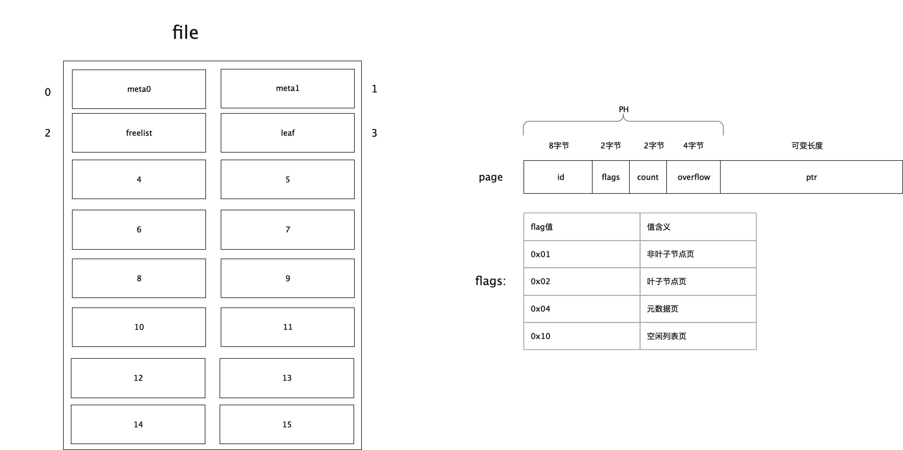

# 第一节 boltdb的物理页page结构

在boltdb中，一个db对应一个真实的磁盘文件。而在具体的文件中，boltdb又是按照以page为单位来读取和写入数据的，也就是说所有的数据在磁盘上都是按照页(page)来存储的，而此处的页大小是保持和操作系统对应的内存页大小一致，也就是4k。


每页由两部分数据组成：**页头数据**+**真实数据**，页头信息占16个字节，下面的页的结构定义

```go
type pgid uint64

type page struct {
	// 页id 8字节
	id pgid
	// flags：页类型，可以是分支，叶子节点，元信息，空闲列表  2字节，该值的取值详细参见下面描述
	flags uint16
	// 个数 2字节，统计叶子节点、非叶子节点、空闲列表页的个数
	count uint16
	// 4字节，数据是否有溢出，主要在空闲列表上有用
	overflow uint32
	// 真实的数据
	ptr uintptr
}

```


其中，ptr是一个无类型指针，它就是表示每页中真实的存储的数据地址。而其余的几个字段(id、flags、count、overflow)为我们前面提到的页头信息。

下图展现的是boltdb中page的数据存储方式。



在boltdb中，它把页划分为四类：

page页类型 | 类型定义 | 类型值 | 用途
---|--- | --- | ---
分支节点页 |branchPageFlag | 0x01 | 存储索引信息(页号、元素key值)
叶子节点页  |	leafPageFlag     | 0x02 | 存储数据信息(页号、插入的key值、插入的value值)
元数据页    |	metaPageFlag     | 0x04 | 存储数据库的元信息，例如空闲列表页id、放置桶的根页等
空闲列表页  |freelistPageFlag | 0x10 | 存储哪些页是空闲页，可以用来后续分配空间时，优先考虑分配

boltdb通过定义的常量来描述

```go
// 页头的大小：16字节
const pageHeaderSize = int(unsafe.Offsetof(((*page)(nil)).ptr))

const minKeysPerPage = 2

//分支节点页中每个元素所占的大小
const branchPageElementSize = int(unsafe.Sizeof(branchPageElement{}))
//叶子节点页中每个元素所占的大小
const leafPageElementSize = int(unsafe.Sizeof(leafPageElement{}))

const (
	branchPageFlag   = 0x01 //分支节点页类型
	leafPageFlag     = 0x02 //叶子节点页类型
	metaPageFlag     = 0x04 //元数据页类型
	freelistPageFlag = 0x10 //空闲列表页类型
)
```

同时每页都有一个方法来判断该页的类型，我们可以清楚的看到每页时通过其flags字段来标识页的类型。

```go
// typ returns a human readable page type string used for debugging.
func (p *page) typ() string {
	if (p.flags & branchPageFlag) != 0 {
		return "branch"
	} else if (p.flags & leafPageFlag) != 0 {
		return "leaf"
	} else if (p.flags & metaPageFlag) != 0 {
		return "meta"
	} else if (p.flags & freelistPageFlag) != 0 {
		return "freelist"
	}
	return fmt.Sprintf("unknown<%02x>", p.flags)
}

```

下面我们一一对其数据结构进行分析。


