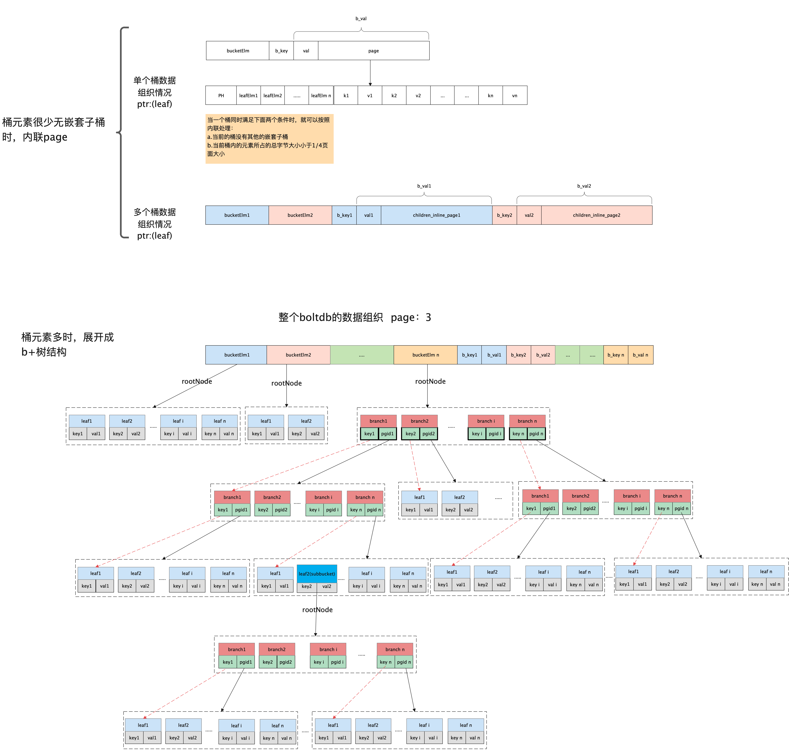

# 第一节 boltdb的Bucket结构

先来看官方文档的一段描述Bucket的话。

> Bucket represents a collection of key/value pairs inside the database.

下面是Bucket的详细定义，本节我们先暂时忽略**事务Tx**，后面章节会详细介绍事务

```go
// 16 byte
const bucketHeaderSize = int(unsafe.Sizeof(bucket{}))

const (
	minFillPercent = 0.1
	maxFillPercent = 1.0
)

// DefaultFillPercent is the percentage that split pages are filled.
// This value can be changed by setting Bucket.FillPercent.
const DefaultFillPercent = 0.5

// Bucket represents a collection of key/value pairs inside the database.
// 一组key/value的集合，也就是一个b+树
type Bucket struct {
	*bucket //在内联时bucket主要用来存储其桶的value并在后面拼接所有的元素，即所谓的内联
	tx       *Tx                // the associated transaction
	buckets  map[string]*Bucket // subbucket cache
	page     *page              // inline page reference，内联页引用
	rootNode *node              // materialized node for the root page.
	nodes    map[pgid]*node     // node cache

	// Sets the threshold for filling nodes when they split. By default,
	// the bucket will fill to 50% but it can be useful to increase this
	// amount if you know that your write workloads are mostly append-only.
	//
	// This is non-persisted across transactions so it must be set in every Tx.
	// 填充率
	FillPercent float64
}

// bucket represents the on-file representation of a bucket.
// This is stored as the "value" of a bucket key. If the bucket is small enough,
// then its root page can be stored inline in the "value", after the bucket
// header. In the case of inline buckets, the "root" will be 0.
type bucket struct {
	root     pgid   // page id of the bucket's root-level page
	sequence uint64 // monotonically incrementing, used by NextSequence()
}

// newBucket returns a new bucket associated with a transaction.
func newBucket(tx *Tx) Bucket {
	var b = Bucket{tx: tx, FillPercent: DefaultFillPercent}
	if tx.writable {
		b.buckets = make(map[string]*Bucket)
		b.nodes = make(map[pgid]*node)
	}
	return b
}
```


下图展现的是数据在bucket中的存储方式。




上面是一个Bucket的定义，在开始下面的内容前，我们先提前介绍一下另一个角色Cursor，因为后面会频繁的用到它。大家在这里先知道，一个Bucket就是一个b+树就可以了。我们后面会对其进行详细的分析。


